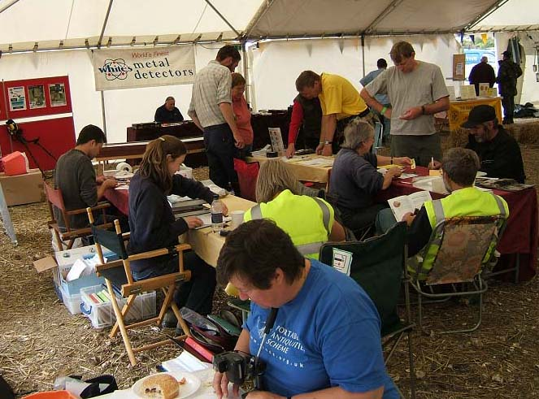
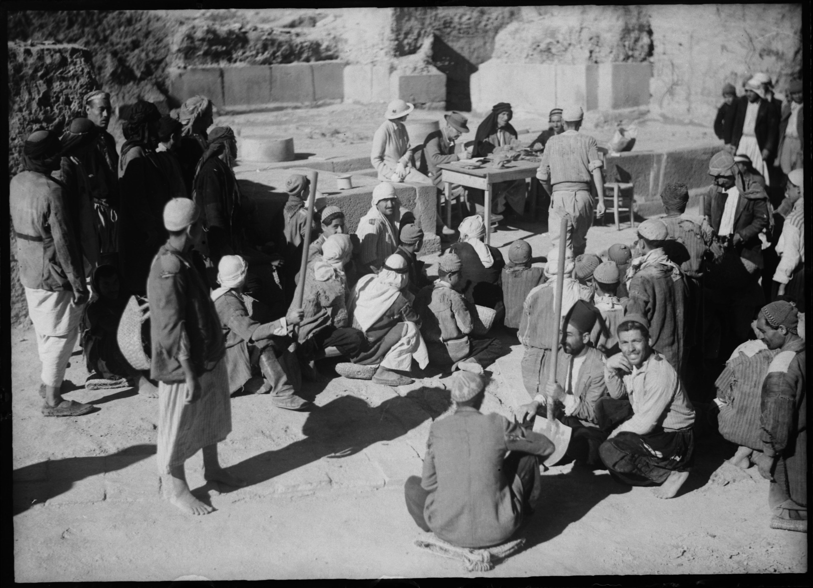
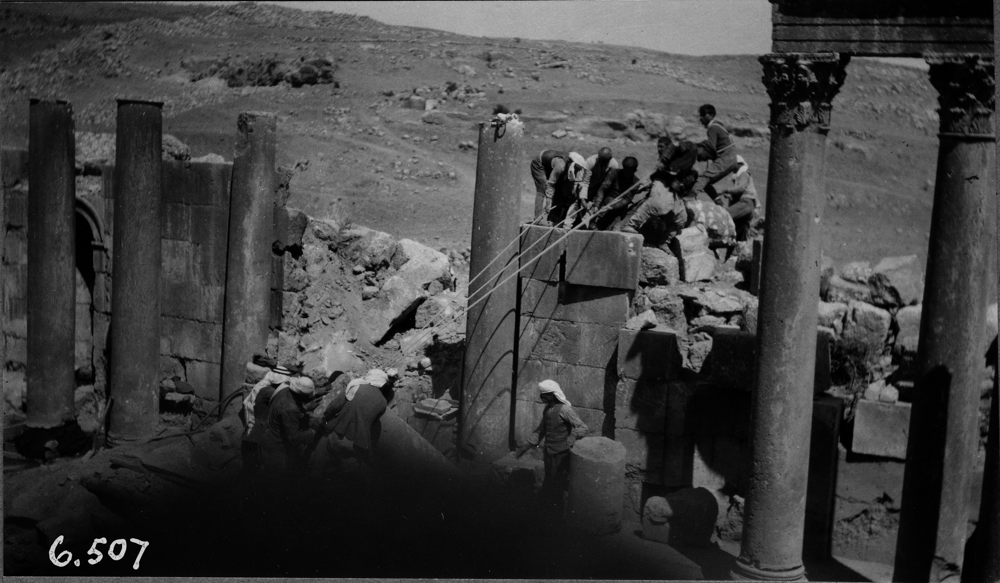

Hello,

This is Chiara. 

Before looking into methods for assessing the value/s of crowd-sourcing using the framework that I briefly outlined in my [previous post](https://blog.micropasts.org/2013/11/14/communities-engagement-experiences-and-value/ "previous post"), I think it important to introduce our proposed model of engagement.

As the title suggests, [Crowd and Community-fuelled Archaeological Research](https://blog.micropasts.org/about-the-project/ "Crowd and Community-fuelled Archaeological Research") looks to engage the public through crowd-sourcing by consolidating and gradually enlarging communities of interest in archaeology and the human past that already exist online and/or offline. It will be interesting to study the dynamics of community building, which could also be seen as the progressive welcoming and organisation of ‘unknown crowds’ into communities.

In the first few months, we will start with proposing three projects for crowd-sourcing and three for crowd-funding, which will deal with content and activities that already have associated communities of interested amateurs.

Some of these communities are organised as local archaeological societies, others are more widespread geographically (for example, the group of metal detectorists who contribute to the [Portable Antiquities Scheme](http://finds.org.uk "Portable Antiquities Scheme")).

We will also leverage on communities related to our partnering institutions. For example, we hope to involve friends of the British Museum and UCL Institute of Archaeology alumni who are keen on the history of archaeology. For them, but also for local communities in the Levant and for anyone fascinated by travels and archaeological discoveries, we will unlock some unique shots from the UCL Institute of Archaeology photographic archives, such as those shown below. We will upload a set of these photographs on our crowd-sourcing platform (now under development) and invite contributors to enrich them through tagging.

One of the most exciting aspects of the project will be that of experimenting with crowdsourcing to review, digitise and enrich existing data (a “[contributory](http://www.participatorymuseum.org/chapter5/ "contributory")” kind of engagement), but also to allow the co-design of new research agendas (“[co-creative](http://www.participatorymuseum.org/chapter5/ "co-creative")” engagement) and propose for crowd-funding those that community members value the most, while enabling communities to use the crowd-funding platform for their own pre-designed archaeological and heritage projects as well (“[hosted](http://www.participatorymuseum.org/chapter5/ "hosted")” model of engagement).

The three components of [MicroPasts](http://micropasts.org "MicroPasts") (crowd-sourcing, co-design and crowd-funding) will be activated progressively in the initial stages of the research. Participants will be encouraged (not obliged) to work in steps, from data co-production, to the use of this data for new research and the retrieval of the financial resources needed to make this research happen. This will help scaffolding the community engagement.

The criteria for identifying the most ‘valued’ projects that should be put forward for crowd-funding, amongst those co-desiged with communities, will be the subject of dedicated discussion with community members on the forum. This collaborative activity will be fundamental to understand what [‘values’](https://blog.micropasts.org/2013/11/14/communities-engagement-experiences-and-value/) are attributed to archaeological research, tangible and intangible heritage, in contemporary society.

The project will then test crowd-sourcing not only as a method for crowd and community-fuelled archaeology, but also as a digital research tool allowing indirect investigation on the role of archaeology and history as formal disciplines and practices in today’s world. In this way, it hopes to contribute to a more [sociologically-oriented public archaeology and to more value-centred heritage studies](https://blog.micropasts.org/2013/11/05/what-is-the-value-of-crowd-sourcing-archaeology/ "sociologically-oriented public archaeology and to more value-centred heritage studies").

I look forward to starting this research and reporting to you about it on this blog!

*[Chiara](http://www.ucl.ac.uk/archaeology/people/staff/bonacchi "Chiara")*