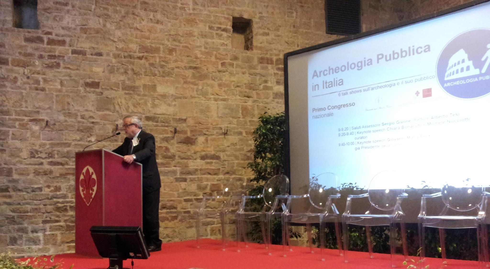

Hello,

I am just back from *[Public Archaeology in a time of crisis](http://www.parcodeitempli.net/pages/giornate-gregoriane-vii-edizione "Public Archaeology in a time of crisis")* a brilliant conference organised at the Valley of the Temples, in Agrigento (Italy), where I was invited as speaker along with other Italian, Greek, Spanish and UK delegates.

Organisers asked:

> how should archaeology change not only to survive the economic crisis, but to improve through it?

The answer, I believe, lies in projects like [Crowd and Community-fuelled Archaeological Research](http://www.ucl.ac.uk/archaeology/research/directory/community-bevan "Crowd and Community-fuelled Archaeological Research") and I will briefly explain why in this post.

Arguably, in several areas of Europe and the Mediterranean especially, archaeology was in a state of crisis well before the most recent economic downturn. However, cuts to public funding and less resources available have urged archaeologists to reflect on pre-existing faults in the system that are no longer sustainable economically and culturally.

In Italy, for example, research, preservation and ‘valorisation’/enhancement (the Italian *valorizzazione* corresponding to the French *mise en valeur*) of cultural heritage (including archaeology) are very fragmented. Only the state has legislative competences on preservation, whereas on matters of heritage ‘valorisation’/enhancement and the organisation of cultural activities lawmaking efforts are shared by state and regions. In addition, the collaboration between superintendences and universities is often not as fluid and positive as it could be.

Public Archaeology as a field of studies can help bridge fissiparations of this kind, as it proposes a model whereby archaeological research, engagement, social research on engagement and on the public for archaeology, ‘valorisation’ and financing (leading to the preservation of archaeological heritage and research institutions) are conducted jointly under the leadership of universities and through cross-sector and interdisciplinary collaborations. Although using different words, this potential merit of Public Archaeology was underlined by the jurist Giovanni Maria Flick at the [First Italian Congress on Public Archaeology](http://www.archeopubblica2012.it "First Italian Congress on Public Archaeology") (2012).

At a time when state money is limited, it becomes more urgent to (a) demonstrate the public value of archaeology in order to attract state funding, and (b) diversify financing schemes. This is where Public Archaeology can help, and our [MicroPasts](http://micropasts.org "MicroPasts") project points in this direction.

It is then fundamental that efforts in the formal development of Public Archaeology teaching and research in continental Europe continue. Work in this area has started, but the path ahead leading to an institutionalisation of the sector in state universities seems to be long still.

In UK Higher Education, instead, more projects including Public Archaeology as an inherent component of the archaeological research that is conducted would help consolidate the field and develop new theory and methods and a rich evidence base.

Chiara