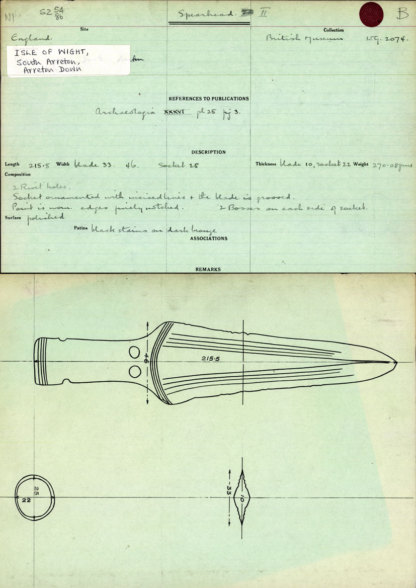
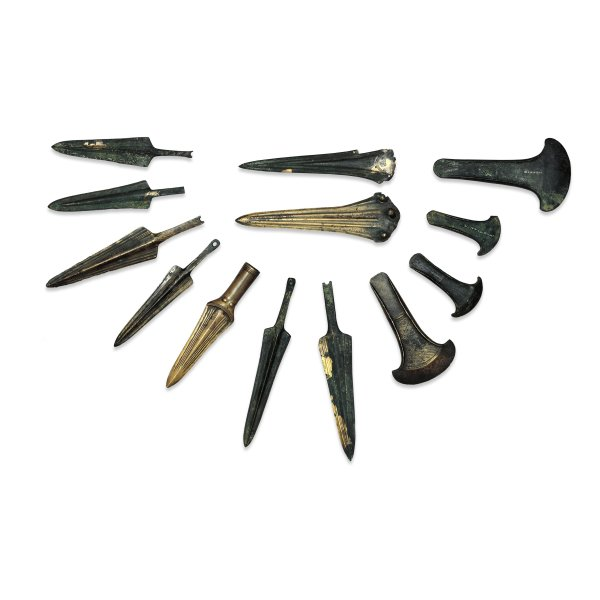
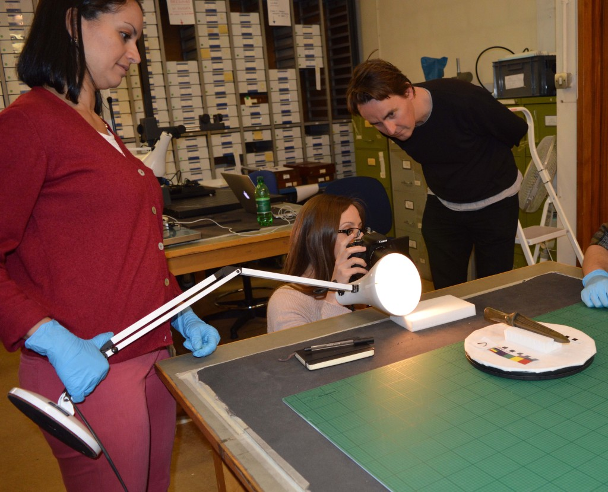
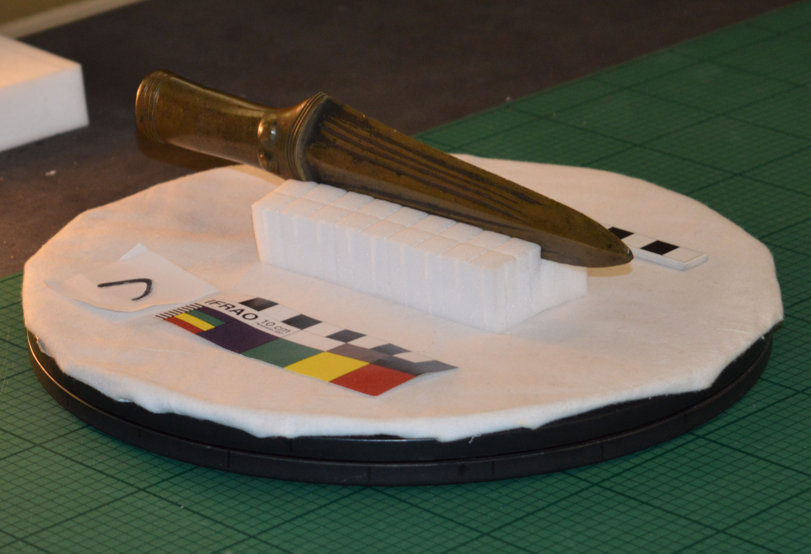

We are in the process of adding a new photo-masking application to the MicroPasts site. This is going to be a bit of a ‘pop-up shop’ as it will only include one Bronze Age British hoard, although it is one of considerable importance.

A hoard is an archaeological terms for two or more objects, normally of metal, deposited together. In some cases these were buried with the intention of recovery, but in other cases they were intended as ‘gifts to the gods’ or suitably auspicious ways of casting off old fashioned or damaged objects.

This particular hoard was found on Arreton Down on the Isle of Wight sometime before 1735, and we think that it was associated with a series of aligned pits. It constitutes a major group of Early Bronze Age spearheads and axes (as well as at least one dagger) that was probably placed in the ground around 1700-1500 BC.

The Arreton Down hoard represents the final metalwork traditions of Early Bronze Age (EBA) in southern England, c. 1700-1500 BC (Britton 1963, 284-97; Burgess &amp; Cowen 1972; Needham 1986). The hoard gave its name to the ‘Arreton phase’ of Early Bronze Age metalwork. This arguably represents the first large scale and frequent burying of metalwork in prehistory, a practice that would continue for many centuries (and millennia) to come.

The Arreton phase gained its important position in the EBA chronology partially due to its early discovery in 1735, and its extensive documentation and exhibition by the Society of Antiquaries of London, the foremost archaeological body of its day (Society of Antiquaries Minutes 1732-7,128-9; Cooke 1737). Arreton Down belongs to a sub-set of hoards which are dominated by spearheads and have been assigned to a particular sub-phase of the Bronze Age (MA VI), and it has one of the best ranges of bronze equipment known from a single EBA context. This rare combination of metalwork types in combination with what appears to be purposeful deposition in a series of aligned pits suggests that the hoard was deposited in the course of ritual practices.

The Arreton hoard includes 16 objects of which 13 are currently in the BM collections: 2 tanged spearheads with rivet, 6 tanged spearheads, 1 tanged and collared spearhead with rivet, 1 socketed spearhead, 1 halberd or dagger, 1 dagger, and 4 flanged axes (illustrated below).

The fun thing about this assemblage from a specialist point of view is how it shows the evolution from low-flanged axes (*Arreton-flanged axes*) in the Early Bronze Age towards something closer to the earliest palstaves (a type of axe with cast flanges and a stop-ridge that is currently also the subject of much work by contributors on the MicroPasts site; see [http://crowdsourced.micropasts.org/app/category/featured/ ](http://crowdsourced.micropasts.org/app/category/featured/%20)(Roberts 2008, 75). Unfortunately, for a long time the provenance of the hoard was subject to great confusion, with some of the bronze finds actually given false provenances to other parts of the UK! Fortunately, research by Stuart Needham, a former British Museum curator of Bronze Age Collections, allowed for the original provenance to be re-established for all but three of the Arreton finds (Needham 1986). Subsequent, responsibly-reported metal detecting in the Arreton area have led to the discovery of additional bronze implements, adding to our understanding of this region in the Bronze Age.

This will be the first complete hoard photographed for 3D modelling and a major challenge will be how well this modelling approach handles the thin edges of the spearheads and internal socket of the dagger. Last week we took hundreds of photos of these objects in the hoard at the BM’s store, including both in very controlled photo-capture conditions and the more ad hoc set-up you see in the image above!

](https://blog.micropasts.org/wp-content/uploads/sites/2/2014/05/3D-Scanning-Franks-2.jpg)

Soon these files will be uploaded as a new MicroPast’s photomasking application, allowing us to create for the first time a full set of 3D models of a Bronze Age hoard! Later this year, we hope to use these photomasked models to potentially make 3D printable models of the hoard on a 3D printer at one of the Samsung Digital Discovery Centre’s ([http://www.britishmuseum.org/learning/samsung\_centre.aspx](http://www.britishmuseum.org/learning/samsung_centre.aspx)) sessions at the BM.

### References

- Britton, D. 1963. “Traditions of Metal-Working in the Later Neolithic and Early Bronze Age of Britain, Part I”. *Proceedings of the Prehistoric Society* XXIX: 258-325.
- Burgess, C.B. and Cowen, J.D. 1972. “The Ebnal hoard and Early Bronze Age Metalworking Traditions”. In F. Lynch and C.B. Burgess (eds) *Prehistoric Man in Wales and the West: Essays in Honour of Lily F. Chitty*, 167-88. Bath.
- Cooke, B. 1737. “Letter to Peter Collinson”, dated 1 Jan 1736/7, *Society of Antiquaries Minutes*, Vol. II: 285.
- Needham, Stuart P. 1986. “Towards the Reconstitution of the Arreton Hoard: A Case of Faked Provenances”. *The Antiquaries Journal* LXVI: 9-28.
- Piggott, S. 1947. “The Arreton Down Bronze Age Hoard”, *The Antiquaries Journal* 27: 177-8.
- Roberts, B.W. 2008. “The Bronze Age”. In L. Atkins, R. Atkins and V. Leitch (eds) *The Handbook of British Archaeology*, 63-93. London: Constable and Robinson.