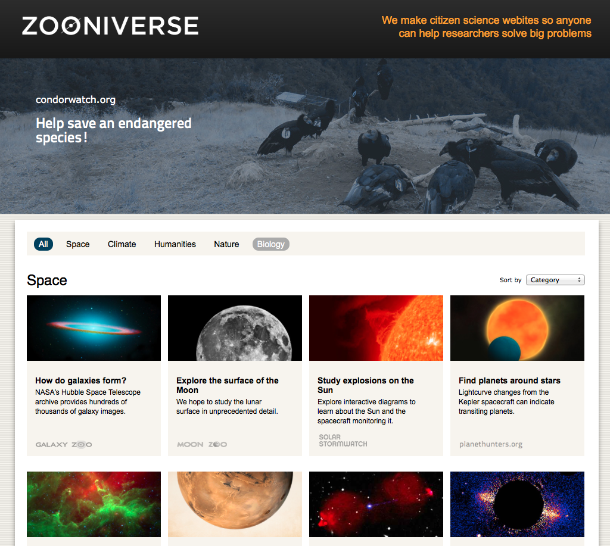
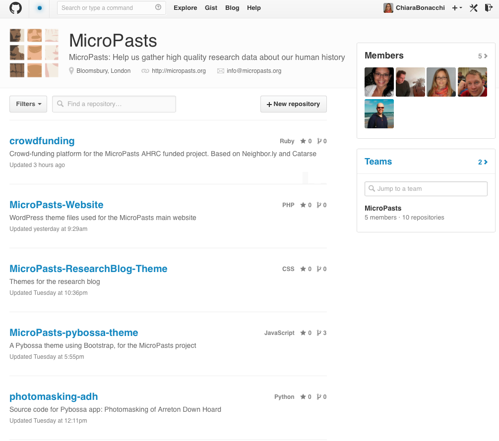

## What do we mean by crowd-sourcing?

Crowd-sourcing is a relatively new digital method for collecting information, services or funds from a large group of people, in small chunks, over the internet. This practice emerged less than a decade ago in the commercial sector, where companies had been exploring ways of out-sourcing labour to potentially interested people around the world. It is sometimes also called ‘micro-tasking’ and, as many novelties in the world of technology, it featured in the well-known magazine *Wired*, where, in 2006, Jeff Howe wrote an article entitled [‘The Rise of Crowd-sourcing’](http://wrd.cm/1nkRGsc).

In recent years, crowd-sourcing has been increasingly used also by professionals and institutions in the science and cultural heritage sectors as a way of conducting research, curating museum collections and managing heritage resources in collaboration with the public.

In some cases, people are invited to contribute their time and skills to help with projects that have been designed entirely by these institutions. In other cases, members of the public can instead propose ideas for projects they would like to undertake and institutions provide platforms and resources to make them happen.

Some crowd-sourcing platforms, like [Zooniverse](http://bit.ly/S39R7P), host a number of differently themed Citizen Science projects focussing on astronomy, climate issues, nature, biology and the humanities. In other cases, museums, libraries or universities set up individual crowd-sourcing pages linked to their websites, as is the case with the [Australian Newspaper Digitisation Programme](http://bit.ly/1o4GJtF).

Developing crowd-sourcing platforms where tens or hundreds of thousands of people can work, potentially simultaneously, is a very challenging endeavour. For example, it is important to ensure that data are produced in formats and at levels of quality that allow for meaningful analysis to be undertaken. In this way contributors’ efforts are not wasted and can really bring new knowledge. For this reason, in the [MicroPasts transcription applications](http://bit.ly/1p4xHw4%5D) only information that is entered by at least two contributors in the same way is saved, and, similarly, we have developed a method for maximising the quality of the images masked via [photomasking](http://bit.ly/1tEBgcG). Another key element is that of communication both within the group of contributors and between contributors and institutions in order to share ideas, confront any problems and propose new initiatives. To this end, MicroPasts uses Facebook, Twitter and a community [forum](http://community.micropasts.org), where we invite comments, suggestions and questions, while providing updates and news about the project.

## The technical side of crowd-sourcing

If you are a developer or just interested in what is ‘behind the scenes’ of the MicroPasts crowd-sourcing website, please do have a look at the code that makes it function.

We have stored it in [repositories](https://github.com/MicroPasts) that are available online on GitHub. Feel free to use and improve the work we have done so far. You might also like to read a [step-by-step guide on how to create your own crowd-sourcing applications using the Pybossa framework](http://bit.ly/SqphUg). We will be happy to answer any questions and hear any observations you might have on MicroPasts software and infrastructure via the [forum](http://community.micropasts.org).

[*Chiara*](http://www.ucl.ac.uk/archaeology/people/staff/bonacchi)