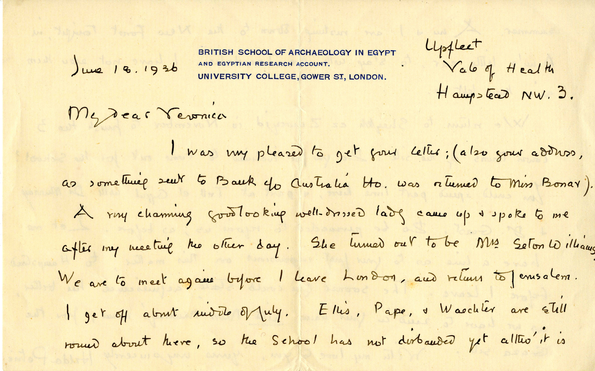

**How can it be useful?**

Letters, documents and literary works are useful for several different kinds of research into the human past. For example, transcribing old excavation records can make them more amenable to spatial and quantitative analysis, whilst transcribing historical documents from past literate societies can be compared and contrasted with the evidence from contemporary objects. Other kinds of transcriptions can also be important for exploring family histories, broader historical movements and phenomena, and personal biographies of archaeologists, historians, philosophers etc. To be used for research purposes, however, this (often hand-written) material needs to be carefully transferred from paper form to digital (typed) formats. In this way, it is possible to preserve the records, while making them widely available beyond the walls of archives and study rooms and enabling computer-aided analysis.

 

Transcribing large quantities of text is not an easy or quick task and requires interpretation skills that computers do not yet have at adequate levels. For this reason, crowd-sourcing the transcription of letters or documents via interested volunteers can produce high quality results, as in the case of the [Transcribe Bentham project](http://blogs.ucl.ac.uk/transcribe-bentham/). In this project, contributors are transcribing the unpublished works of the philosopher and reformer Jeremy Bentham (1748-1832), thereby helping to prepare a new edition of the *Collected Works of Jeremy Bentham*. As Bentham himself wrote: ‘Many hands make light work. Many hands together make merry work’. Another interesting project where transcription is successfully used to research the history of archaeology is [UR Crowdsource](http://urcrowdsource.org/omeka/). Here, people are helping document the famous excavations that took place from 1922 to 1934 at the site of Ur, in present-day Iraq, by reading and transcribing letters, field notes and reports from the dig.

On the MicroPasts [crowd-sourcing platform](http://crowdsourced.micropasts.org/), we have developed an application to transcribe the object cards that were written to record a vast number of Bronze Age metal artefacts found in the eighteenth, nineteenth and twentieth centuries up until the 1970s. These cards allow us to know more about objects’ features, places of discovery, and any published information relevant to them. The information is hand-written in often neat and aesthetically pleasing styles, but can at times be difficult to decipher. Thus, volunteers’ help is crucial for digitising these resources and enabling the exploration of the Bronze Age Index and the history of this catalogue (e.g. the geographic and chronological scope of its records), but also, for example, the examination of the recurrence of certain features within a same class of artefacts.

Currently, we are working on the development of a second type of application for transcribing cards which are also part of the Bronze Age index, but describe the context of discovery of specific finds rather than the objects themselves. This transcription work will be slightly different, requiring fewer text boxes and more ‘free text’. We also hope that, in future, the MicroPasts crowd-sourcing platform will foster further transcription work. One way to achieve this is for both volunteer communities and academic institutions to identify archaeological and historical transcription projects of joint research interest and fund them via the MicroPasts crowd-funding site.

*[Chiara](http://www.ucl.ac.uk/archaeology/people/staff/bonacchi)*