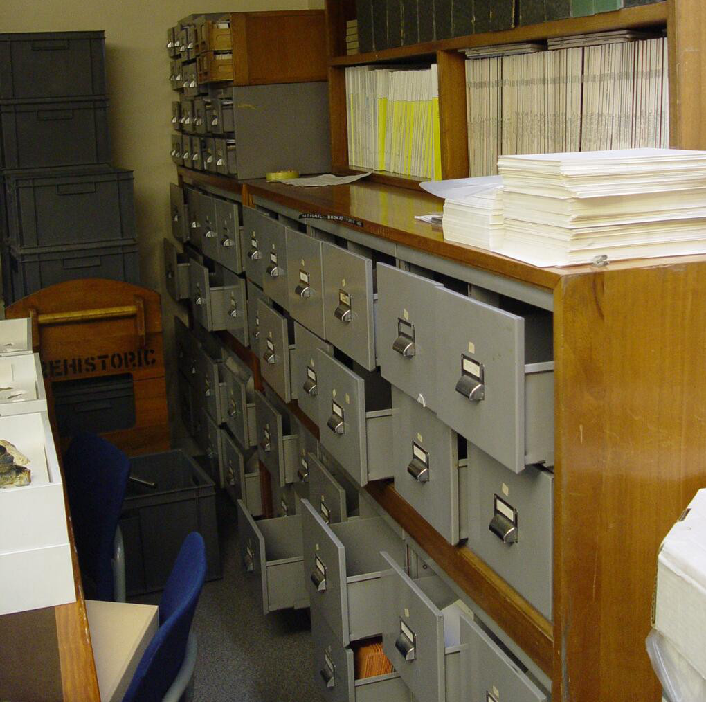

The index of the British Museum was a major archaeological initiative first founded in 1913 and then moved to the British Museum in the 1920s. For over 70 years, it represented the highest standards of Bronze Age artefact studies. This catalogue contains index cards detailing object find spots and types, alongside detail line drawings and a wide range of further information about the object’s context of discovery.

 

Part of the reason to transcribe the index is so that its estimated 30,000 records can be incorporated rapidly into the [Portable Antiquities Scheme](http://finds.org.uk/ "Portable Antiquities Scheme") database, which has also been created with the help of people across England and Wales. The PAS database includes nearly 930,000 objects, which have been collected by the public, usually by metal detectorists. Integrating the transcribed cards with the numerous records of archaeological objects discovered by the public will thereby create a near complete digital inventory of metal finds from Bronze Age Britain. There are also some records of finds from outside of Britain in the index and in some cases, these can be sent to other national databases in Europe as well.

Georeferencing the finds will support the kinds of large-scale spatial analysis discussed [here](http://discovery.ucl.ac.uk/1341767/). Knowing as much information as possible about the archaeological context of these finds (e.g. as recorded on the cards) is very useful for building up a clearer picture of how metal objects were produced, exchanged, used and discarded in the Bronze Age.