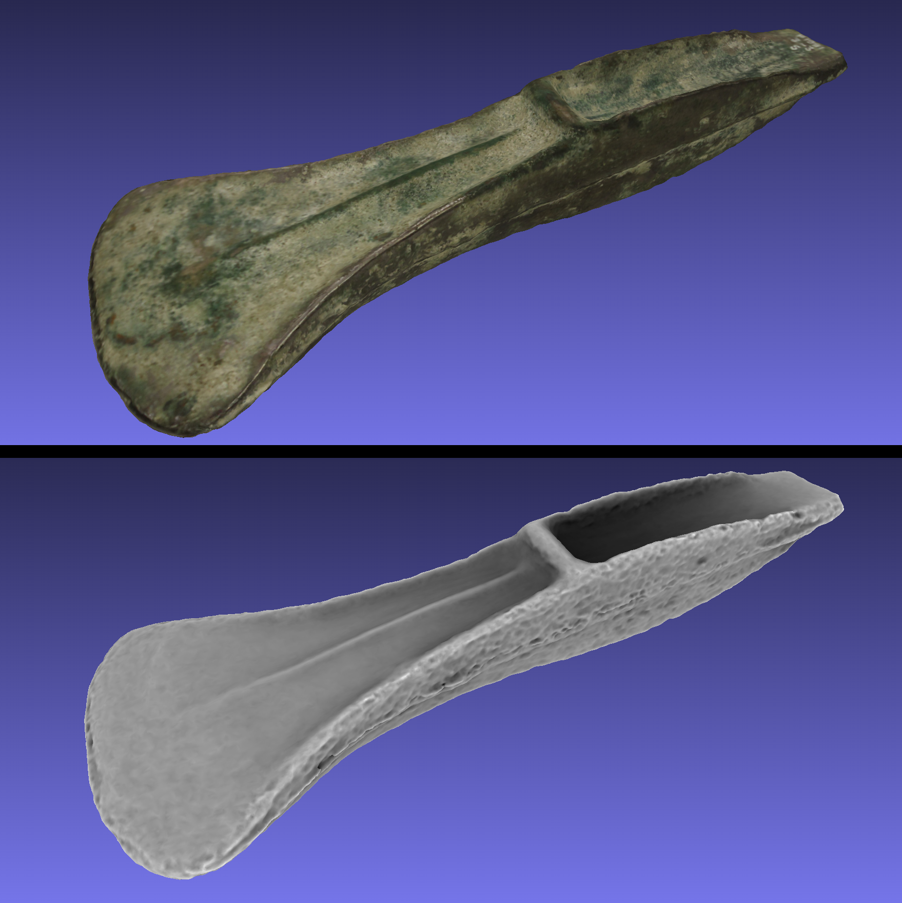
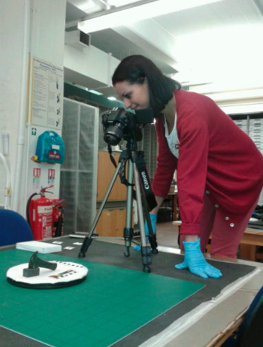

**What is it and how can it be used?**

Archaeology was unusually quick to adopt 2D mapping (GIS) technologies at the end of the 1980s and early 1990s, but now 3D approaches to recording everything from small artefacts to whole excavations and large landscapes are fast becoming popular. There are a variety of different methods involved, including both the use of laser scanners (sometimes known as LiDAR, especially when used at the landscape scale) and of photograph-based techniques that fall under the umbrella term ‘photogrammetry’.

MicroPasts is fostering a photogrammetric method known as [Structure-from-Motion (SfM)](http://en.wikipedia.org/wiki/Structure_from_motion) which does away with most of the complicated camera and target set-ups used by more traditional methods. SfM can create 3D colour-realistic models from ordinary digital photographs, often taken in ordinary conditions with ordinary cameras. Most generally, SfM is also a form of ‘computer vision’, the science of allowing computers to ‘see’ the world around them whether through range-finding, still images, video, etc.

3D models are fun to play around with and can be re-used in museum displays, immersive virtual environments or computer games. This is one of the reasons we are making them available under licenses that encourage rather than restrict such unanticipated uses (we would be really interested to hear on the [forum](http://community.micropasts.org) of any applications that you can think of). They are also useful for school and university teaching, especially in situations where it is impossible to access the physical objects or archaeological landscapes themselves.

For research purposes, 3D landscape models allow us to place archaeological finds in an accurate topographic setting, and we can also then modify these virtual landscapes better to reflect the way they looked in particular periods of the past. This then allows us to explore more rigorously what factors might, for example, have affected where people from a particular period chose to locate their settlements, or to consider what parts of the archaeological landscape have suffered from erosion or have been covered up by river silts. 3D models of standing buildings (e.g. prehistoric megalithic monuments or Medieval churches, see [Susie Green’s blog](http://archaeologysfm.blogspot.co.uk/)) not only preserve a 3D snapshot of archaeological structures that unfortunately get damaged and decay through time, but also allow better studies of masonry styles and construction techniques.

3D models of artefacts allow specialists to compare finds in the same virtual space in ways they could never do so physically: for example, you can interact with and compare the details of several different bronze axes via 3D models in ways you could never do physically because those artefacts might each live in a different museum. One key further implication of SfM for artefact-based research is the fact that we can now collect not just one or two models, but hundreds or thousands. This means we can compare the sizes and shapes statistically (e.g. of similar Bronze Age axe types), because the sample of modelled objects is big enough. Although it is early days for such research, the expectation is that computer-based 3D shape analysis will lead to much finer, more informative typologies/taxonomies of objects, a better sense of how these change through time, and in some cases finer dating. You can even apply such statistical comparisons to irregular shapes such as the body-parts of statues (for an example looking at the ears of the Chinese Terracotta Warriors, see [here](http://authors.elsevier.com/sd/article/S0305440314001927) and a related [blog post](http://www.ucl.ac.uk/terracotta-army/blog/posts/2014-06-12)).

 

### How can I create a 3D model?

SfM models are constructed in several distinct steps, involving photo-capture, image-masking, camera alignment, point-cloud construction, meshing and texturing (some of these being obligatory, others optional). There are also ways to use online tools with which anyone can build 3D models via SfM by uploading raw photos they have captured (e.g. [photosynth](http://photosynth.net) or [123dcatch](http://www.123dapp.com/catch)). However, better results can usually still be achieved offline, and for objects, ‘masking’ out the background of the photo achieves a much better result than simply asking a computer to distinguish crisply between object and background on its own, especially when the object has had to be flipped over at several stages to capture all sides (hence the background has been altered in ways that deceive the computer).

Currently, we have focused on enabling photo-masking tasks on the MicroPasts platform but are currently developing a project where we ask contributors to visit certain kinds of archaeological sites themselves, capture their own photographs and upload them to the site. If you are interested in contributing in this way, you can also have a look at two very good ongoing projects of this kind in Scotland and Wales ([heritagetogether](http://heritagetogether.org) or [accordproject](http://accordproject.wordpress.com)).

We have written a set of working notes about good practice in creating SfM models (comments and improvements welcome) that will give you a clearer sense of how these methods work ([SfM Photographic Strategy](https://github.com/MicroPasts/MicroPasts-TechnicalNotes/raw/master/pdf/1-PhotoCapture_Artefacts.pdf), [SfM Offline Photo Masking](https://github.com/MicroPasts/MicroPasts-TechnicalNotes/raw/master/pdf/2-PhotoMasking_Artefacts.pdf), [SfM Model Construction](https://github.com/MicroPasts/MicroPasts-TechnicalNotes/raw/master/pdf/3a-ModelCreation_Artefacts_Photoscan.pdf)). These working notes provide examples using both commercially-licensed software and open source alternatives wherever possible.

*Andy*