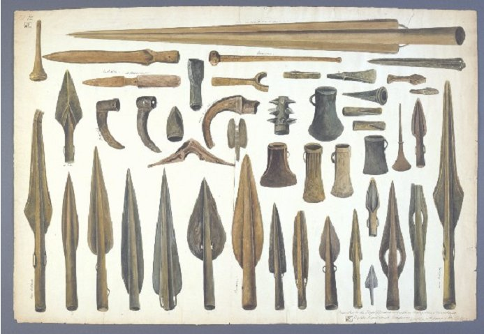
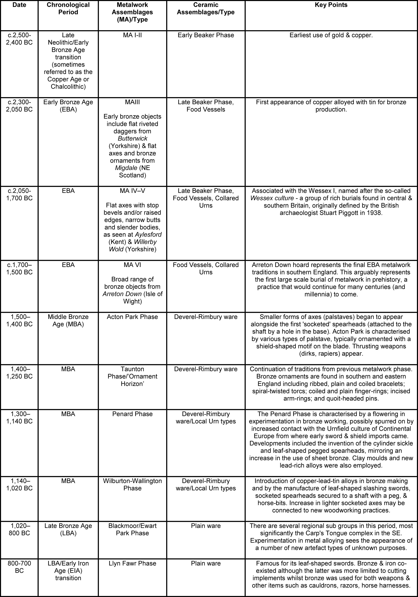
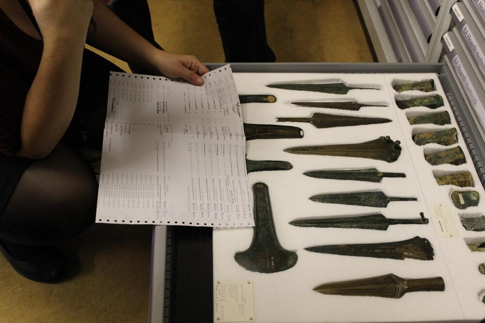

What we call the ‘later prehistory’ in Britain and Ireland traditionally spans the first use of metal artefacts and thereafter the replacement of bronze technologies with iron, an overall period of approximately two and a half millennia which starts around 2500 BC and, by academic convention, is said to end with the Roman conquest of Britain in AD 43 (which brings in the a series of hitherto missing documentary sources for the historian and hence is deemed to be roughly the end of ‘prehistory’ where our evidence is largely archaeological), spanning the *Bronze Age* and *Iron Age* chronological periods.

## Bronze Age Metal Objects: Background & Overview

Given that a major early component of the MicroPasts project involves looking at Bronze Age metal objects from Britain, the following section provides a little background information in order to understand how the subject developed and the basic outline of the period and topic.

 

The term ‘Bronze Age’ was developed by the Danish archaeologist Christian Thomsen (b. 1788 – d. 1865), to sit between the Stone Age and the Iron Age in his ‘three-age system’. Although the simplicity of Thomsen’s scheme has been questioned in the intervening years, and other important divisions have been recognised, it remains relevant, and the Bronze Age has a distinct character of its own. The date and character of the Bronze Age do, however, differ across Europe, with communications and mobility between regions and countries also changing through time.

In Britain, the Bronze Age is a period used by archaeologist to refer to the centuries from 2500 to 800 BC. At the start of the period (from 2500 to 2200 BC) only gold and copper were being used, but from 2200 BC bronze was created by mixing (alloying) tin and copper. In the initial period (around 2200-2000 BC), Irish copper and Cornish tin were used in bronze production. The sources of copper then changed as new mines (especially in Wales) were exploited and Continental metal was brought into Britain. The first iron objects appear from around 1000 BC, and the Iron Age is said to begin around 800 BC (again, this is more a convenient academic label, rather than an abrupt historical ). The Bronze Age chronologies are notoriously complex, but here is a table summarising the main developments by period:

 

From around 1500 BC, the evidence for the contexts in which we find metal objects changes from burials to ‘hoard’ deposits. Hoards, defined loosely as two or more objects deposited together, that are often treated in special and unusual ways prior to deposition (for instance swords may be intentionally bent and ornaments folded and broken up). This hoarding practice may sometimes have had a religious or ritual significance, a point also suggested by the location of the deposits in unusual and special places (e.g. rivers, bogs and natural features). Indeed, although opinions vary, current thinking tends to suggest that hoards were ‘gifts for the Gods’ (akin to pennies thrown into wells with the expectation of a granted wish), rather than purely ‘rubbish’ or items stored for safe keeping.

Communities also made use of ceramics throughout the period, expressing identities through particular styles. These were often deemed important enough to deposit with the dead, particularly during the period between 2500 to 1500 BC (e.g. Beakers, Food Vessels and Collared Urns). Although the survival of organics from this period is rare, there are sufficient examples to know that communities were highly skilled at working these materials as well.

Most of the archaeological evidence for the earlier part of the period (c.2500 to 1500 BC) comes from funerary evidence and monuments and there is little evidence for permanent settlements of any size or scale. This may suggest that communities and populations were still relatively small-scale by comparison with later periods. Towards the end of the Bronze Age (from 1500 to 800 BC) there is, however, greater evidence for roundhouses and field systems, particularly in Southern England.

If you are interested in reading more about later prehistoric Britain these resources might help to get you started:

## Published resources 

### Books &amp; articles

- Cowie, T. 1988. *Magic Metal. Early metalworkers in the North-East*. Aberdeen: University of Aberdeen
- Cunliffe, B. 2004. Iron Age Britain (Revised Edition). London: B.T. Batsford/English Heritage
- Darvill, T. 2010. Prehistoric Britain (2nd edition). London: Routledge
- Langmaid, N.G. 1976. *Bronze Age Metalwork in England and Wales*, Aylesbury: Shire Archaeology
- Needham, S. 1996. “Chronology and Periodisation in the British Bronze Age”. *Acta Archaeologica* 67, 121–40.
- Parker Pearson, M. 2005. Bronze Age Britain (Revised Edition). London: B.T. Batsford/English Heritage
- Pearce, S.M.1984. *Bronze Age Metalwork in Southern Britain*, Aylesbury: Shire Archaeology
- Piggott, S. 1938. “The Early Bronze Age in Wessex”. *Proceedings of the Prehistoric Society* 4, 52-106.
- Pollard, J. (ed.) 2008. Prehistoric Britain, London: Blackwell
- Pryor, F. 2004. Britain BC: life in Britain and Ireland before the Romans, London: Harper Perennial
- Roberts, B.W. 2008. “The Bronze Age”. In L. Atkins, R. Atkins and V. Leitch (eds) *The Handbook of British Archaeology*, 63-93. London: Constable and Robinson
- Roberts, B.W., Uckelmann, M., &amp; Brandherm, D. 2013. “Old Father Time: The Bronze Age Chronology of Western Europe”. In H. Fokkens &amp; A. Harding (eds) *The Oxford Handbook of the European Bronze Age*, 17-46. Oxford: Oxford University Press.
- Worsaae, J.A.A. 1843. *The Primeval Antiquities of Denmark (Danmarks Oldtid oplyst ved Oldsager og Gravhøie)*. London: John Henry Parker.

### Web resources

- The Bronze Age guide on the British Museum/Portable Antiquities Scheme website: [*http://finds.org.uk/bronzeage*](http://finds.org.uk/bronzeage)
- British Museum’s Introduction to the Bronze Age: *[http://www.britishmuseum.org/explore/cultures/europe/bronze\_age.aspx](http://www.britishmuseum.org/explore/cultures/europe/bronze_age.aspx)*
- A collection of useful web links and resources about prehistory, collated by the Prehistoric Society: [*http://www.prehistoricsociety.org/links/*](http://www.prehistoricsociety.org/links/)
- Scottish Archaeological Research Framework (ScARF), Neolithic to Iron Age panels provides useful overviews: [*http://www.scottishheritagehub.com/*](http://www.scottishheritagehub.com/)
- BBC History, Neolithic &amp; Bronze Age Overview: [http://www.bbc.co.uk/history/british/timeline/neolithic\_timeline\_noflash.shtml](http://www.bbc.co.uk/history/british/timeline/neolithic_timeline_noflash.shtml)