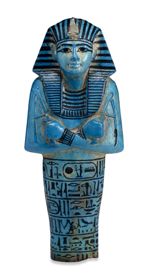

If you’d lived in Ancient Egypt, you would probably have strongly believed that death was not the end, and that it was only a transition between this world and the next. Ancient Egyptians believed that after they die, or more precisely after their bodies die, some parts of their soul (termed ‘ka’ and ‘ba’) kept on living in a spiritual realm known as the underworld, or Duat – the realm of the dead.

It was not at all straightforward to get to this underworld. You first had to be mummified so that your body was well preserved and thus suited to move on to the next life. Secondly, you had to pass a crucial test on your judgment day, a procedure known as the ‘weighing of the heart’. If you were a good person and hadn’t sinned, then your heart would be lighter than the feather of truth and justice (Ma’at), and you’d be allowed to continue your journey into the afterlife. Finally, you’d have to know how to overcome all obstacles on your journey, so it was advised to have a copy of the Book of the Dead handy. This book contained magic spells devised to help you to complete your journey successfully.

  

However, making it to the underworld was not the end of the story. In order to ensure your immortality after death, your family, friends and/or subjects should have remembered to place some food and drinks in your tomb. In addition, even though dead, you were not exempt from work. You were expected to carry out tasks such as ploughing fields and harvesting crops. But if you were well prepared, you made sure that someone else could do the work for you. So while you could enjoy your days watching the sun god Ra on his daily boat ride through the sky, someone else was tasked do the tedious routine chores for you. Therefore, alongside your mummified body, some food, the Book of the Dead, everyday objects, and other paraphernalia needed to smooth your journey into the afterlife, your tomb would include a series of funerary figurines known as shabtis (or ushabtis). These shabtis were usually shaped like a mummy and may have had your name and title inscribed on them. Otherwise, they may have been inscribed with a text from the 6th chapter from the Book of the Dead, including a phrase sending them to action – “to plough the fields, or to fill the channels with water, or to carry sand from the East to the West”.

Tasked mainly for agricultural duties, the shabtis often carried a hoe in their hands, a basket on their backs, or some other tools (depending on their roles). They were usually small, between 10 and 30 cm in size, and would most commonly be made of faience, or otherwise from terracotta, wood, stone, metal or glass. While the practice of using shabtis emerged in the Old Kingdom, they became common starting from the Middle Kingdom onwards and were in use until the end of the Ptolemaic Period. Many of them were made in mass production, and from the 21st Dynasty on, tombs could be found filled with a great number of shabtis. Some tombs had hundreds of shabtis covering the tomb floors. Better be prepared for all that afterlife work!

*Adi*