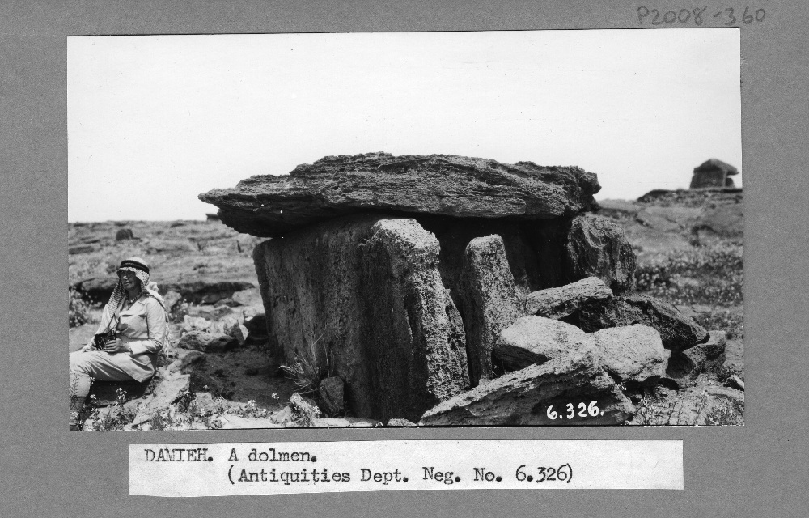
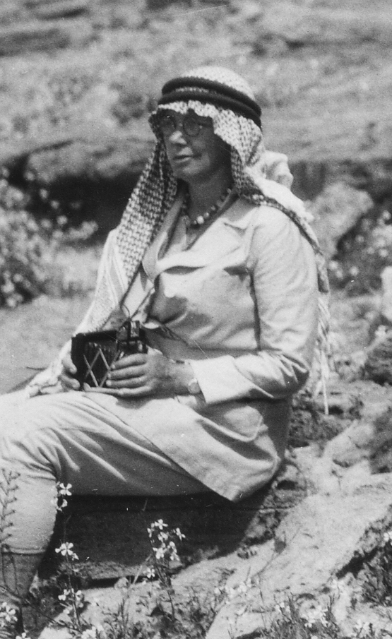
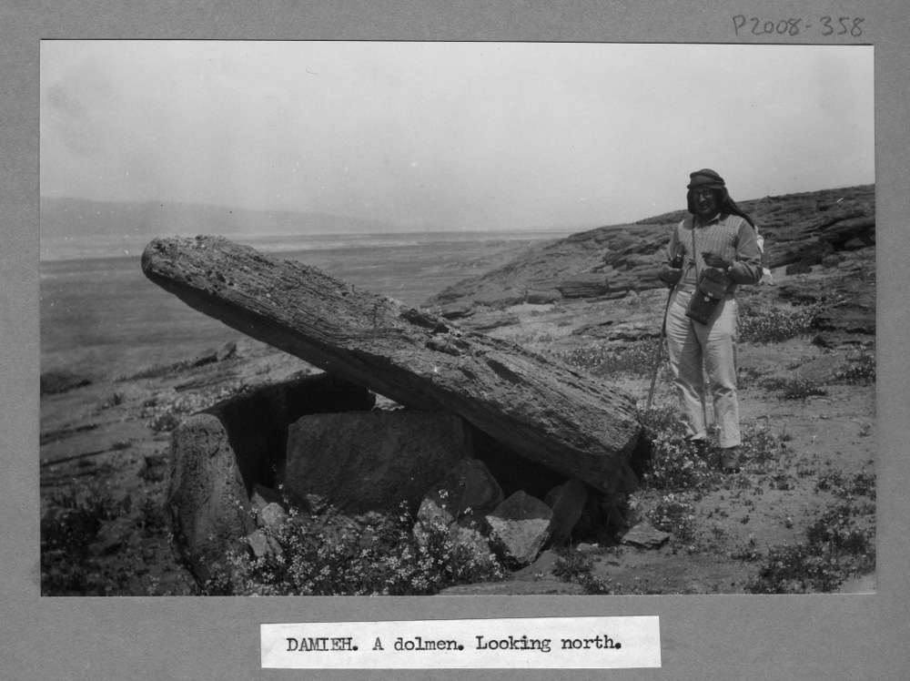
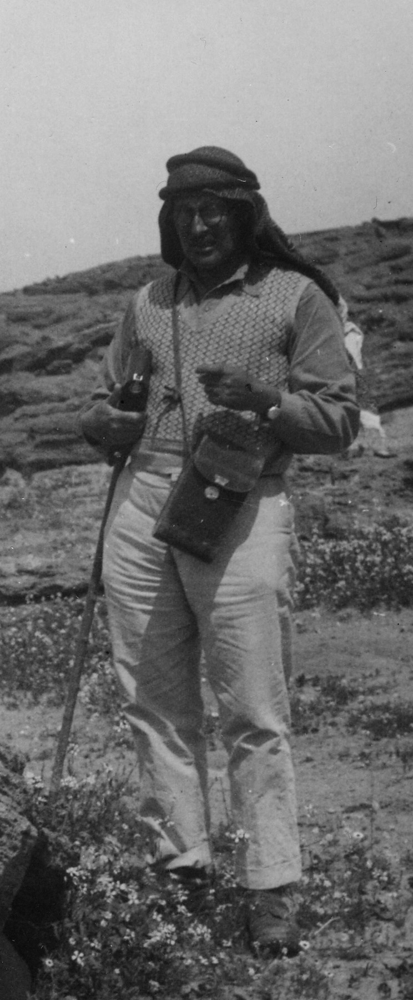

**[Amara Thornton](mailto:amara.thornton@ucl.ac.uk) (British Academy Postdoctoral Research Fellow, UCL Institute of Archaeology)**

> My life has been so lonely – until I met you – dear Comrade … my extraordinary friendship with you – which I gradually found was absorbing the whole of my life – I did not in the least understand – you stood as pure intellect to me.
> – George Horsfield to Agnes Conway, c. November 1931

Everyone loves a love story, right? Well, dear readers, this *is* one.

MicroPasts has now launched an [application](http://crowdsourced.micropasts.org/app/phototaggingHorsfield/) where you can tag a group of photographs of different sites and locations in the Middle East. The photographs come from an archive that belonged to the British archaeologists George Horsfield (1882-1956) and his wife Agnes Conway Horsfield (1885-1950).

I’ve been researching and publishing on the Horsfields for a number of years now. I first came across these photographs and others in the Horsfield archive in 2006, when I was an MA student. The images were what inspired me to undertake a PhD investigating the history of archaeology through a network of British archaeologists – including George and Agnes. The following sections will introduce George and Agnes, provide a bit of context on the historical period in which they lived and worked, and examine the circumstances of their archive’s accession. I hope you’ll find exploring Mandate Palestine and Transjordan with the Horsfields as interesting as I do.

**Meet the Horsfields**

Leeds-born George Horsfield trained as an architect in London and worked for one of the most well known American Gothic Revival architectural practices in New York City before the First World War. At the outbreak of war, he enlisted as a volunteer, and saw action on the Western Front. At war’s end, demobilised, he embarked on a new career in archaeology. Admitted in 1923 as a student in the new British School of Archaeology in Jerusalem (BSAJ), Horsfield gained experience in excavating and excavation management, and brought his architect’s eye to interpreting and conserving sites. After his BSAJ training in Palestine, Horsfield worked primarily in Transjordan. He became the Chief Curator/Inspector in the Transjordan Department of Antiquities.

]

In 1928, he met Agnes Conway for the first time. Conway was the daughter of a mountaineering art-historian, author and politician and his American wife. She studied History at Newnham College, Cambridge – *before* Cambridge started giving women degrees. Her interest in archaeology developed at Newnham too, under the supervision of the classicist Jane Harrison.

After leaving Cambridge, Agnes Conway embarked on many different projects, including studying at the British School at Rome and the British School at Athens, and cataloguing and enhancing her father’s vast photograph collection. When her father became the first Director General of the Imperial War Museum during the First World War, she worked with a team of other women to collect material relating to women’s war work, and continued working on the collection and display of this material into the 1920s. By this point she had also published two books: 

*A Child’s History of Art* (1909)and *A Ride Through the Balkans: On Classic Ground with a Camera* (1917). 

She also began extensive research on the Wyatt family, whose Kent castle the Conways were slowly restoring.

In 1929, after meeting George Horsfield, the pair began an investigation of the site of Petra in Transjordan, the famous “rose red city” of the Nabataean civilisation, with two other scholars, Tewfiq Canaan and Ditlef Nielsen. George and Agnes continued to collaborate on analysing Petra over the next few years, and their friendship evolved into love. They married in January 1932 in Jerusalem, and settled in a house in Jerash, in the midst of the remains of the Roman town that had once flourished there.

They remained based at Jerash, travelling frequently in Transjordan and Palestine, until 1936, when George Horsfield left his position at the Department of Antiquities. The Horsfields embarked on a few years of Mediterranean travel, returning to live in London during the Second World War. Agnes Conway Horsfield died in 1950; George Horsfield moved to Cyprus thereafter and died in Kyrenia in 1956.

## Archaeology in the Mandates

Prior to the First World War, the region that became Palestine and Transjordan was part of the Ottoman Empire. During the war, the Sykes Picot agreement, the Arab Revolt and the Balfour Declaration all contributed to the post-war reshaping of former Ottoman Empire territories into distinct countries – Syria, Mesopotamia (renamed Iraq) and Palestine. Britain had occupied Jerusalem from late December 1917. Then, under League of Nations issued Mandate agreements, Britain gained administrative responsibility for Palestine from 1920. In 1923 Transjordan (the land east of the Jordan River) was separated from Palestine under a new British Mandate agreement.

A British-run administrative framework was instituted in Palestine, with a British High Commissioner at the top, and various departments such as Treasury, Customs, Immigration, Education, Agriculture, and Health. There was also a Department of Antiquities, established in 1920, with antiquities legislation set out in Article 21 of the Mandate Agreement.

The Department of Antiquities issued permits for excavation and generally undertook survey work, documented archaeological sites and antiquities, made provision for guards for the sites, and took steps to open sites to tourists. There was also a revitalisation of the museum in Jerusalem, and provision for smaller local museums elsewhere in Palestine.

Transjordan also had its own Department of Antiquities, with close links to the Department of Antiquities in Palestine. George Horsfield had originally been sent to Transjordan from Palestine to lend his architectural expertise to the conservation of sites, specifically Jerash. When he became Chief Curator/Inspector in Transjordan he had similar responsibilities to the Director of Antiquities in Palestine: inspecting sites, ensuring guards were in place, and, with Agnes as his collaborator, documenting sites throughout the country where possible. He also helped to build a small museum at Jerash, and wrote a guide to the site that was published in 1933.

The Transjordan Department of Antiquities had little funding for large-scale work. Thus the Horsfields mainly undertook survey work and facilitated excavations by others, including archaeological teams from the American Schools of Oriental Research and the French Ecole Biblique et Archéologique Française of Jerusalem.

### The Horsfield Photographs

In 1951, after Agnes’s death, George Horsfield wrote directly to V. Gordon Childe, then Director of the Institute of Archaeology in London, offering Childe what he described as his wife’s material on Petra and Transjordan which he hoped would be useful for the Institute’s students. Two boxes were duly shipped to the Institute’s premises at St John’s Lodge, Regent’s Park, and a further packet of photographs arrived a short time later. (Whether any students actually used the archive is still to be discovered.)

George Horsfield’s correspondence with Childe reveals that the contents of the boxes had been put together ‘without examination’, which I think contributes to the variety (and in some senses haphazard array) of material associated with the Horsfields in this collection. The two boxes that arrived in 1951 have over the ensuing decades been distributed into seventeen archive boxes, which (most likely because the material was not examined before its donation) contain a collection documenting not only the Horsfields’ work at Petra and travels in the region, but also Agnes’s pre-marriage trips to Greece, Sierra Leone and Iraq.

What results from George and Agnes Horsfield’s donation, then, is a partial but by no means insignificant view into the life and work of an antiquities inspector and his wife (and equal partner) in archaeology in Mandate Transjordan.

The photographs now available for tagging in MicroPasts are among the most formally presented in the archive, being mounted and labelled. They reflect George and Agnes’s lives and work in the Middle East. The Horsfields themselves appear only rarely in front of the camera, and when they *are* there, they are absent in the captions (see Figs 1-4). Agnes Conway was very interested in photography, and spent hours practicing with her camera – as you can see from Fig 2, she holds her camera firmly in her grasp.

The Horsfields’ photographs document an archaeological and historical landscape that has changed dramatically in the decades since the photographs were taken. They need to be read as part of an important period in the history of Britain and the Middle East – and this history continues to affect the region to this day.

Researching the context of the Horsfield archive is a continuing work in progress, particularly as complementary archives become more accessible through active cataloguing. There are many more histories yet to be revealed. However, we can start to discover them together here, through images. The MicroPasts platform forces you, as contributors, to look at these photographs in detail – and the closer you look, the more you find!

## References/Further Reading

### On the Horsfields

* Conway, A. and Conway, W. M. 1909. *The Children’s Book of Art.* London: Adam &amp; Charles Black. Available at: <http://archive.org/stream/childrensbookofa00conw#page/n7/mode/2up>
* Conway, A. 1917. *A Ride Through the Balkans: On Classic Ground with a Camera.* London: Robert Scott. Available at: <http://archive.org/details/ridethroughbalka00conwuoft>
* Conway, A. and Horsfield, G. 1930. Historical and Topographical Notes on Edom: with an account of the first excavations at Petra. *Geographical Journal* 76 (5): 369-390.
* Evans, J. 1966. *The Conways: A History of Three Generations.* London: Museum Press.
* Horsfield, A. 1943. Journey to Kilwa, Transjordan. *Geographical Journal* 102 (2): 71-77.
* Horsfield, G. 1933. *Official Guide to Jerash: With Plan.* Government of Transjordan, Department of Antiquities.
* The Times. 1950. The Hon. Mrs George Horsfield. *The Times Digital Archive* \[Online\], 7 September. (subscription)
* The Times. 1956. Mr George Horsfield. *The Times Digital Archive* \[Online\], 15 August. (subscription)
* Thornton, A. (forthcoming). The Nobody: Exploring Archaeological Identity with George Horsfield (1882-1956). *Archaeology International*.
* Thornton, A. &amp; Perry, S. 2011. Collection and Production: The History of the Institute of Archaeology through Photography. *Archaeology International, 13/14*, 101-107. DOI: <http://dx.doi.org/10.5334/ai.1319>.
* Thornton, A. 2011. *British Archaeologists, Social Networks and the Emergence of a Profession: the social history of British archaeology in the Eastern Mediterranean and Middle East, 1870-1939.* Unpublished PhD thesis, University College London.
* Thornton, A. 2011. The Allure of Archaeology: Agnes Conway and Jane Harrison at Newnham College, 1903-1907. *Bulletin for the History of Archaeology, 21* (1), 37-56. DOI: <http://dx.doi.org/10.5334/bha.2114>.
* Thornton, A. 2009. George Horsfield, Conservation and the British School of Archaeology in Jerusalem. *Antiquity Project Gallery* \[Online\]: <http://antiquity.ac.uk/projgall/thornton322/>
* Thornton, A. 2006. Explorations in the Desert: The Photographic Collection of George and Agnes Horsfield. *Papers from the Institute of Archaeology* *17*, 93-100. DOI: <http://dx.doi.org/10.5334/pia.273>.
* Who Was Who. HORSFIELD, George. *Who Was Who*. A &amp; C Black \[Online edn\]. Available at: [www.ukwhoswho.com/view/article/oupww/whowaswho/U2388067](http://www.ukwhoswho.com/view/article/oupww/whowaswho/U2388067) (subscription)

### On the history of archaeology in Mandate Palestine and Transjordan

* Albright, W. 1963. *The Archaeology of Palestine*. Harmondsworth: Penguin Books.
* Abu el-Haj, N. 2001. *Facts on the Ground*: *Archaeological Practice and Territorial Self-Fashioning in Israeli Society.* Chicago, IL: University of Chicago Press. 
* Gibson, S. 1999. British Archaeological Institutions in Mandate Palestine, 1917-1948. *Palestine Exploration Quarterly 131* (2): 115-143. DOI: dx.doi.org/10.1179/peq.1999.131.2.115.
* Moorey, R. 1991. *A Century of Biblical Archaeology.* Cambridge: Lutterworth.
* Thornton, A. (forthcoming). Social Networks in the History of Archaeology: Placing Archaeology in its Context. *Workshop Proceedings:* *New Historiographical Approaches to Archaeological Research*. Berlin Studies of the Ancient World.
* Thornton, A. 2012. Archaeologists-in-Training: Students of the British School of Archaeology in Jerusalem, 1920-1936. *Journal of Open Archaeology Data,* 1:1, DOI: <http://dx.doi.org/10.5334/4f293686e4d62>.
* Thornton, A. 2012.(ed). Tourism as Colonial Policy? *The History of Heritage Tourism in Mandate Palestine and Transjordan* \[Special Issue\] *Public Archaeology* 11 (4). (subscription)

### General histories of Mandate Palestine and Transjordan

* Abu-Nowar, M. 1989. *The Creation and Development of Transjordan, 1920-1929: a history of the Hashemite Kingdom of Jordan.* Oxford: Ithaca Press.
* Abu-Nowar, M. 2005. *The Development of Transjordan 1929-1939: a history of the Hashemite Kingdom of Jordan.* Oxford: Ithaca Press.
* Fromkin, D. 1989. *A Peace to End all Peace: the fall of the Ottoman Empire and the creation of the modern Middle East.* New York: Avon Books.
* Luke, H. and Keith-Roach, E. 1922. *The Handbook of Palestine.* London: Macmillan and Co., Limited. Available at: <http://archive.org/stream/handbookofpalest00lukeuoft#page/ii/mode/2up>
* Luke, H. and Keith-Roach, E. 1930. *The Handbook of Palestine and Transjordan.* (2nd edn). London: Macmillan and Co., Limited.
* Wasserstein, B. 1978. *The British in Palestine: the mandatory government and the Arab-Jewish conflict 1917-1929.* London: Royal Historical Society.
* Wilson, M. 1987. *King Abdullah, Britain and the Making of Modern Jordan.* Cambridge: Cambridge University Press.