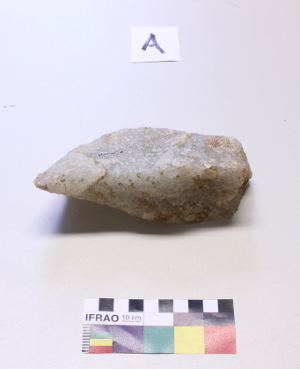
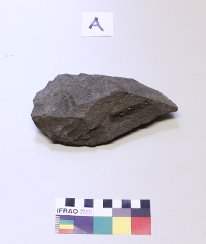

These two handaxes belong to the EF-HR locality, in Olduvai Gorge (Tanzania). EF-HR is located in the North side of the Olduvai Gorge. It was discovered in 1931 by Sir Evelyn Fuchs and Professor Hans Reck, and named after their initials. The first excavations were undertaken by M. Leakey in 1963, and then by OGAP ([Olduvai Geochronology Archaeology Project](http://www.olduvai-gorge.org)) since 2009. 

Both handaxes were found in the surface of the EF-HR outcrops, and therefore their stratigraphic provenance is uncertain; they could have eroded either from Middle/Upper Bed II (around 1.5 myr ago) or from Bed III (slightly more recent), but are definitely older than 1 million years.

EFHR-L0-2 is made of quartzite, probably sourced by hominins from the nearby Naibor Soit, a metamorphic hill located less than 2 km away from EF-HR. This handaxe is poorly shaped, and involves no bifacial flaking. Thus, it is not a real biface, which is a type of stone tool typical of later periods of the Acheulean, but which is rare during the early stages of this technological period. EFHR-L0-17 is made of lava raw material, which was available to hominins as cobbles and boulders in river streams flowing from the volcanic highlands into the Olduvai paleolake. Like EFHR-L0-2, the EFHR-L0-17 handaxe is made on a very large flake, which was then shaped to achieve large cutting tool morphology, and likely used in heavy duty activities involving wood working and animal butchering.

You can view the 3D models created with the help of the crowd here:  

 <iframe title="Handaxe EFHR-LO-2" frameborder="0" allowfullscreen mozallowfullscreen="true" webkitallowfullscreen="true" allow="autoplay; fullscreen; xr-spatial-tracking" xr-spatial-tracking execution-while-out-of-viewport execution-while-not-rendered web-share src="https://sketchfab.com/models/6415c6c3d7c04e23b2e5ddf92a9dd6e8/embed"> </iframe> 

 <iframe title="Handaxe EFHR-LO-17"  allowfullscreen mozallowfullscreen="true" webkitallowfullscreen="true" allow="autoplay; fullscreen; xr-spatial-tracking" xr-spatial-tracking execution-while-out-of-viewport execution-while-not-rendered web-share src="https://sketchfab.com/models/2f32b8b969b64a6e986b742f4acbf1d7/embed"> </iframe>

Ignacio de la Torre