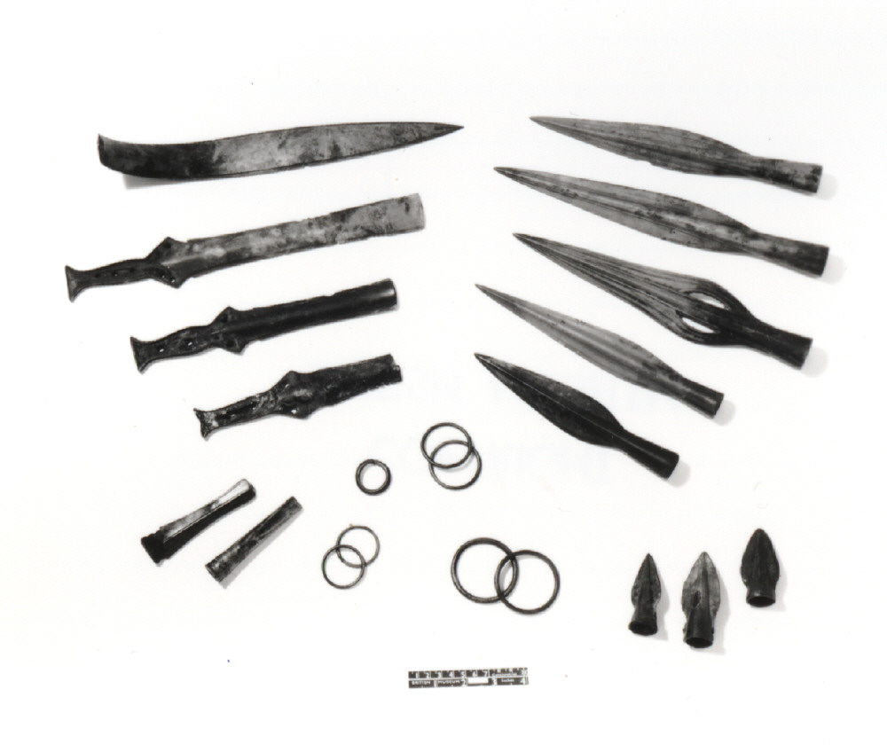
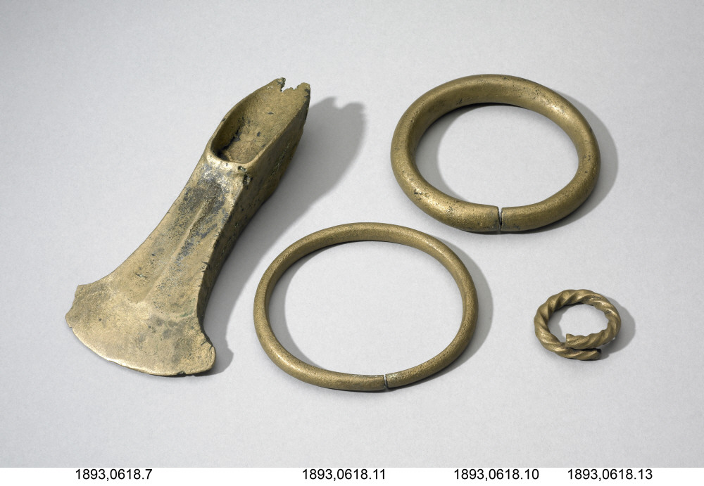
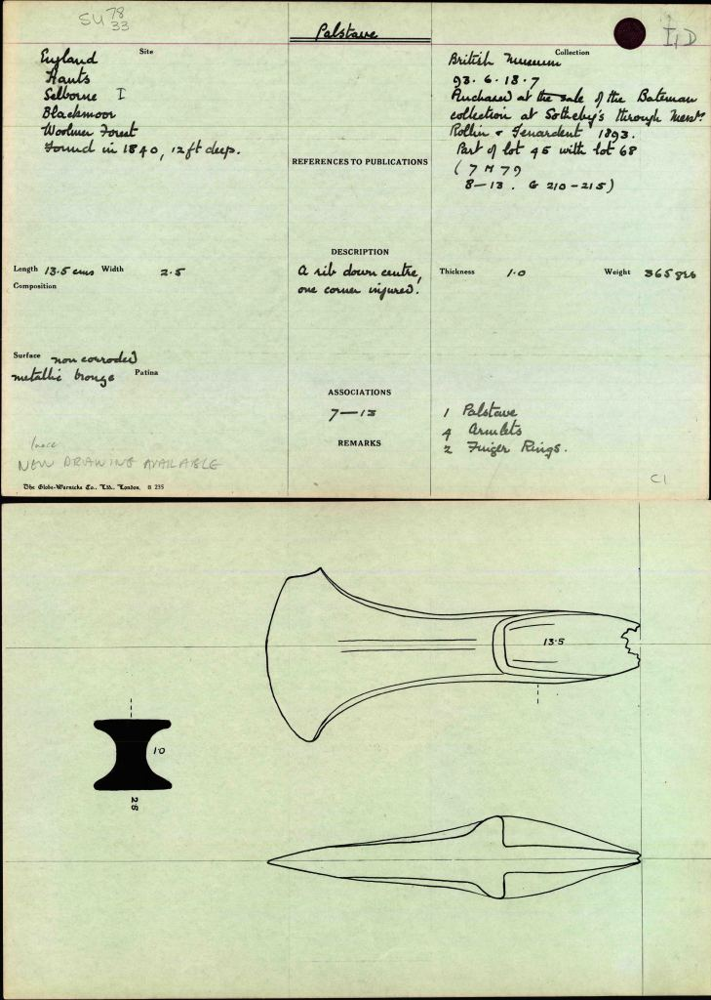
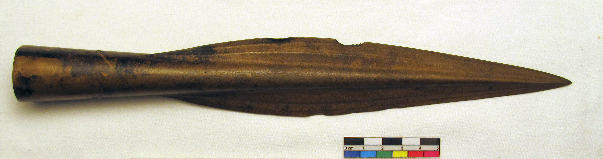
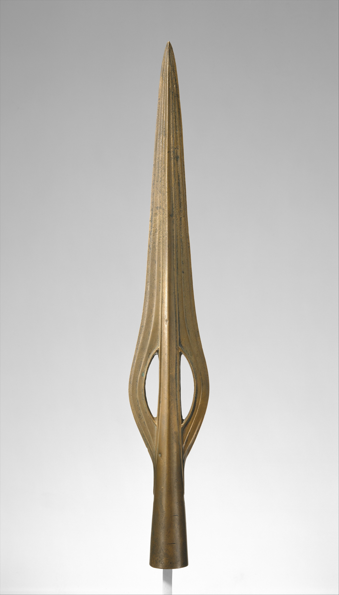
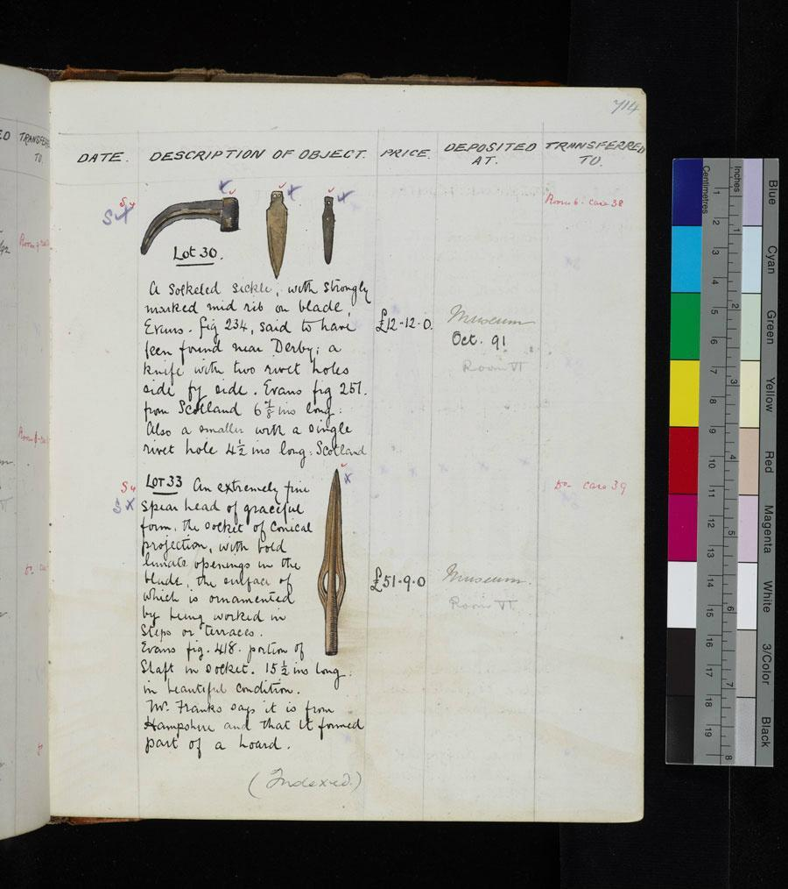

Our new app focuses on the wonderful *Blackmoor Hoard* (partially pictured above). Known also as the ‘Blackmoor-Wolmer Forest’ or ‘Selborne’ Hoard, the hoard was found near the hamlet of Blackmore (just east of Selborne, Hampshire) on the land that was originally part of Lord Selborne’s estate. Multiple hoards from different periods, including various Romano-British coin hoards, have been found in this region and the area was clearly a focus for prehistoric activity. There is a high concentration of Bronze Age barrows within the area of Woolmer Forest as well as a number of Bronze Age hoards which have been found in the vicinity at Woolmer Forest, Woolmer Pond, Hogmoor, Longmoor Camp and Whitehill Village Hall. The connection between the ritual deposition of bronze weapons and the barrow cemeteries together constitute a particularly well-preserved ritual landscape of the Late Neolithic and Bronze Age periods (Allen 2007).

Like many of the hoards found in the Bronze Age Index (we wrote about the [Arreton Down](https://blog.micropasts.org/2014/05/30/3d-modelling-of-the-arreton-down-hoard/) hoard earlier), Selborne is an antiquarian collection, connected to a series of famous collectors of archaeological antiquities including Rev. Greenwell, George Roots, General Pitt-Rivers, and Lord McAlpine.

Both Middle Bronze Age (MBA) and Late Bronze Age (LBA) hoards (an overview of Bronze Age chronology was discussed [previously](https://blog.micropasts.org/2014/06/20/later-prehistoric-britain-the-development-of-bronze-age-metal-objects/)) from the area are featured in the Bronze Age Index. The MBA hoard was found in 1840 and contains two small torcs, four bronze rings and one palstave (pictured below):

The LBA weapon hoard, discovered in the garden of a cottage near Blackmoor in the spring of 1870, is more famously-known. This hoard has a complicated history of collection. A large part of the hoard was handed over to Lord Selborne, as it was found on his land. He displayed it in the former billiard room of his home Blackmoor House. It currently makes up part of the Selborne Collection now in possession of the [Gilbert White Museum](http://www.gilbertwhiteshouse.org.uk/), the home of the 19th century naturalist who wrote *The Natural History of Selborne* (the earliest reference to the hoard was first mentioned Bell’s updated 1877 edition of the volume (White 1877)). This included sword fragments, over twenty large and small spearheads, three rings, some ferrule fragments, and one mysterious ‘grooved socket’ not found anywhere else in BA Britain.

Somehow two large groups of objects from the hoard were separated from the Selborne collection. We have no records of what exactly happened, but some of the hoard was disposed of soon after discovery and sold to two prominent antiquarian collectors, George Roots and Rev. William Greenwell. The Greenwell collection (BM accession numbers WG. 2100-2112, 1269) is composed largely of various spearheads associated to ‘Blackmoor-Woolmer Forest’ and was donated to the British Museum by John Pierpont Morgan in 1908. The Roots collection is larger and more diverse in object types, it is largely composed of spearheads, sword and sword fragments, and cast rings, though it was originally associated to the ‘south of England’ and then ‘Woolmer Forest’. Evidence suggests that the Selborne, Greenwell, and Roots assemblages were all part of the same deposit. Spearhead fragments from the Selborne and Roots Collections fit together, and a number of the short stumpy spearheads in all three collections appear to be made from the same mould (Colquhoun 1979; Colquhoun and Burgess 1988).

The Roots collection was sold by Christies (Christie’s London April 20, 1891, lot 33) to the British Museum in 1891 (BM accession numbers 1891.0514.4-58). At this sale, one extraordinary example of a lunette spearhead (pictured above and currently part of New York City’s Metropolitan Museum of Art (MET) collection 1998.540.1) was bought by General Pitt-Rivers and displayed in his museum on the Rushmore Estate in Farnham, Dorset. This was a secondary institution founded just after the Pitt Rivers Museum (Oxford) in 1885 focusing on local history and prehistoric crafts from Europe &amp; Asia (MacGregor 1987). The spearhead’s origins in the Roots collection as well as its typological similarity to spearheads found in the Selborne/Blackmoor hoard, for example the slightly smaller lunette spearhead featured in figure 1, suggests that this spearhead does probably come from the same region and hoard. Metallurgical analysis (Northover 1982; Hughes, Northover &amp; Staniaszek 1982) also appears to indicate a similar composition to spearheads directly associated with the Selborne/Blackmoor hoard.

](https://blog.micropasts.org/wp-content/uploads/sites/2/2014/11/B1hKvcdCEAIudbw.jpg)

This spearhead remained in the Pitt Rivers collections until the Farnham Museum closed down in 1966, and much of collections were dispersed to the Salisbury Museum and South Wiltshire Museum as well as some private collectors. Sometime after, the spearhead became part of Lord McAlpine’s extensive collections, published in *Antiquities from Europe and the Near East in the Collection of the Lord McAlpine of West Green* (MacGregor 1987). After he got involved in the restoration of the Victorian town of Broome in Western Australian, Lord McAlpine sold off much of his private estate and collections, including the spearhead to the New York art dealer Peter Sharrer (The Art Newpaper, 19 January 2014). Sharrer donated the spearhead to the [MET](http://www.metmuseum.org/collection/the-collection-online/search/470329?=&imgNo=0&tabName=gallery-label) in 1998, along some other BA objects originally from the Roots Collection, where it is on display in Room 301, one of the few representations of the British Bronze Age in the museum.

Why is the Selborne/Blackmoor hoard is interesting, and why do we view these LBA weapons, particularly the MET spearhead, as objects of beauty? Extensive analysis by Colquhoun (1979) identified that the typologies of the main artefact groups (spearheads, swords, rings, and chapes) from the hoard fit well into the end of LBA Wilburton (c. 1,140-1,020 B.C.) and beginning of the Ewart Park (1,020-800 B.C.) metalworking traditions. In fact, the Blackmoor hoard is a sub-period of the Ewart Park phase dating to around 1000-900BC, and it is an important hoard to show the transition between Wilburton and Ewart Park metalworking traditions, which is also seen at a few other sites (Isleham&amp; Fulbourn Common (Cambridgeshire), Sturry (Kent), and Marston St. Lawrence (Northamptonshire)) in southern England.

Hoards from this period are composed largely of weapon types. In SE England metalwork hoards tend to be more dominated by weapons along the tributaries of the Thames Valley, including the Wey River catchment where the Selborne-Blackmoor hoard was found (Yates and Bradley 2010: 61). While Colquhoun originally interpreted the ‘scrap nature of this hoard’ as representing a ‘founder’s hoard’ (e.g. containing a mix of broken metal objects, ingots, casting waste, and complete objects often for retrieval and/or remelting at a later time), recent research suggests that these objects were being purposely deposited in the ground in a particular, possibly ritualistic, manner.

Rather than actually being weapons used exclusively in everyday struggles or battles, the weapons found in these types of hoards may more likely be representative of social status and a ‘warrior aesthetic’ that developed later in the Bronze Age (Treherne 1995). A recent analysis by Schulting &amp; Bradley (2013) of MBA-EIA skulls found in the Thames shows that almost all exhibit blunt force injuries at a time when the archaeological record is dominated by edged weapons (e.g. swords and spears). This suggests that the main form of injuries in this period were not necessarily caused by sharp bronze weapons, but rather blunt objects! Not only does this have implications for the massive record of elaborate bronze weapons found in the Thames and other watery locations, but for all weapon hoards. Perhaps this explains why we get such elaborate and beautiful examples of weapons both from the Thames and from LBA hoards, as the MET describes the [Selborne spearhead](http://www.metmuseum.org/collection/the-collection-online/search/470329?=&imgNo=0&tabName=gallery-label) *representing the highest tradition of the British Bronze Age. The piece is undeniably beautiful: its shape is elegant and spare to the point of evoking modern art. The raised rib in the middle, which also outlines the half-moon or lunette openings, may have been designed as a blood channel.*

 *Special thanks to Daniel Pett and Neil Wilkin for their assistance on this post!*

## References

* Burgess C. and D. Coombs, eds.1979. *Bronze Age Hoards: Some Finds Old and New*. Oxford: BAR British Series 67.
* Colquhoun I, 1979. “The Late Bronze Age hoard from Blackmoor, Selborne”, In Burgess and Coombs (eds). *Bronze Age Hoards: Some Finds Old and New*. Oxford: BAR British Series 67: 99-115.
* Colquhoun, I. and C. Burgess, 1988. *The Swords of Britain.* Munchen: Prähistorische Bronzefunde (C.H.Beck).
* Coombs, D.G., 1975. “Bronze Age Weapon Hoards in Britain”. *Archaeologia Atlantica* 1: 49-81.
* Hughes, M.J., J. P. Northover, and B. E. P. Staniaszek, 1982. “Problems in the Analysis of Leaded Bronze Alloys in Ancient Artefacts”. *Oxford Journal of Archaeology* 1: 359-364.
* MacGregor, Arthur, 1987. *Antiquities from Europe and the Near East in the Collection of the Lord McAlpine of West Green*. Oxford: Ashmolean Museum.
* Needham, S., 1996. “Chronology and Periodisation in the British Bronze Age”. Acta Archaeologica 67, 121–40.
* Northover, Peter, 1982. “The Metallurgy of the Wilburton”. *Oxford Journal of Archaeology* 1: 69-109.
* The Art Newspaper, 19 January 2014*. Art collector and political fundraiser extraordinaire, Alistair McAlpine has died, aged 71.* Obituaries Section: [http://www.theartnewspaper.com/articles/-Art-collector-and-political-fundraiser-extraordinaire-Alistair-McAlpine-has-died-aged–/31577](http://www.theartnewspaper.com/articles/-Art-collector-and-political-fundraiser-extraordinaire-Alistair-McAlpine-has-died-aged--/31577)
* Treherne, Paul, 1995. “The Warrior’s Beauty: The Masculine Body and Self-Identity in Bronze-Age Europe”. *Journal of European Archaeology* 3: 105-144.
* White, Gilbert, 1877 The Natural History and Antiquities of Selborne, in the county of Southampton. Edited by Thomas Bell. London: John Van Voorst.
* Yates, David and Richard Bradley, 2010. “The Sitting of Metalwork Hoards in the Bronze Age of South-East England”. *The Antiquaries Journal* 90: 41-70.