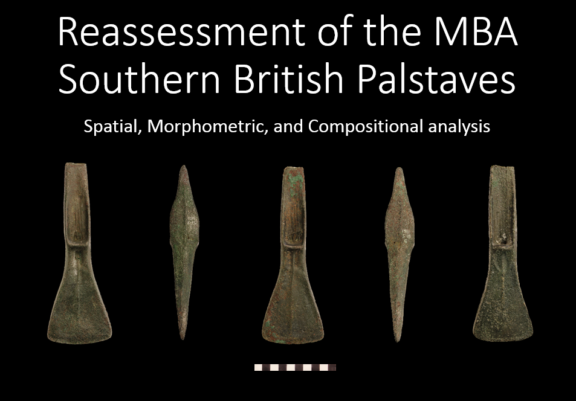

Hi everyone. My name is Robert Kaleta and I am a 1st year PhD student at the Institute of Archaeology, University College London, interested in using some of the data generated via the MicroPasts photo-masking applications for my research. For the next 3 years I will be looking very closely at various aspects of the Middle Bronze Age (MBA) metalwork with particular focus on palstaves. Metal artefacts are crucial to our understanding of the Bronze Age, and the ‘palstave’ is one of the period’s most well-known and widely-distributed forms. Analysis of prehistoric metal finds reveals not only technological aspects of production but also wider relationship between metal, metalworkers and prehistoric societies. I am hoping to use the metalwork as an indicator of various social and economic processes occurring during that time, through which the social organisation of Bronze Age communities across Britain can be explored. The project itself will employ a range of techniques, such as point pattern analysis, chemical composition analysis, and geometric morphometrics, to synthesise the existing data and generate new information. Point pattern analysis allows us to understand the spatial relationship between data points, i.e. whether they tend to congregate or not, and at what scales, which can be a useful indicator of the layout of the Bronze Age communities. This approach, when combined with chemical composition analysis can also shed light on metal circulation, reuse and trade networks.

 

The morphometric analysis aspect of the project is particularly important as one of the main aims of my research is to explore the existing typologies of palstaves. Typologies play a crucial role in the study of the British and European Bronze Age. They have been linked to European-wide chronologies; they defined states and social identities, and exposed the extraordinary extent of trade and exchange during the MBA. However the way in which they had been explored in the past was fairly subjective and the methodology difficult to apply to large data sets that are now available. My aim is to achieve more objective shape properties which can be compared across many objects. One of the ways in which I hope to improve our understanding of the extent of palstave shape variability is through the comparison of their 3 dimensional shapes. This method does not focus on any particular features of the palstaves but compares the overall shape across many objects; removing some of the subjectivity that previous approaches exhibited.

I hope to analyse as many palstaves as possible, starting with the objects held by the British Museum, which should keep me busy for some time. As such, I will use all the masks and resulting 3D models created via the MicroPasts crowd-sourcing site including the two latest apps (Burley &amp; Wylye hoards) and some new ones that will be deployed in the upcoming months. I will do my best to keep everyone updated on my progress and share any interesting findings on the blog, in the meantime if you have any questions regarding the use of 3D models in archaeological research or my own PhD project specifically, feel free to contact me here or on the MicroPasts forum.

Ps. Great work on the Bronze Age Index!

Rob

*Research funded through the London Arts & Humanities Partnership*
