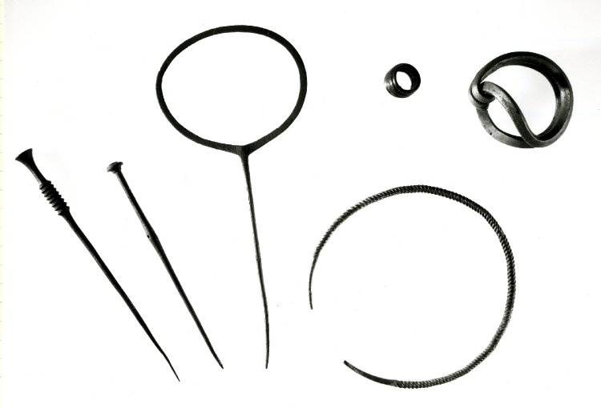
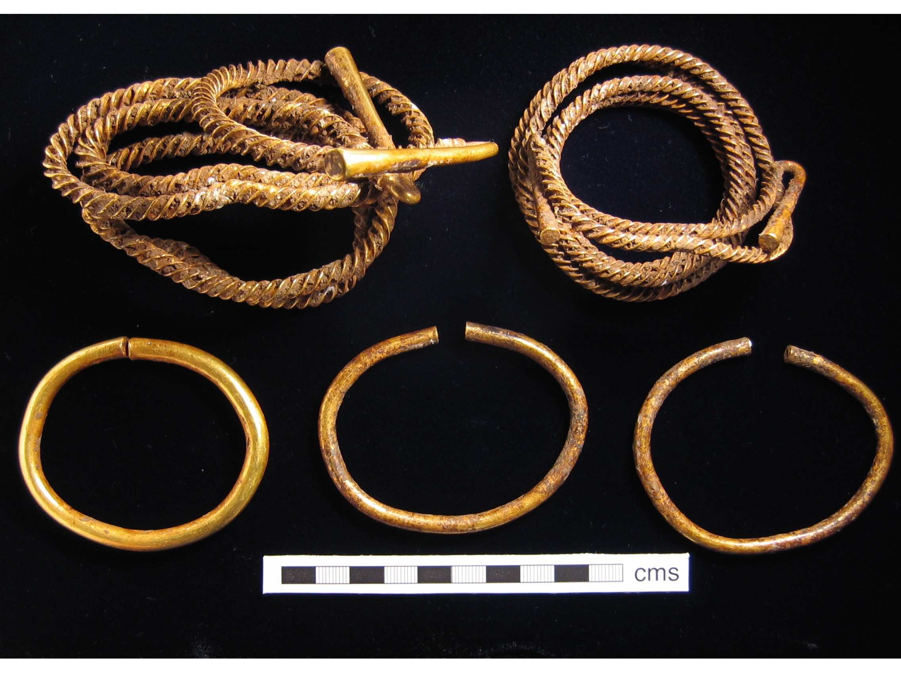
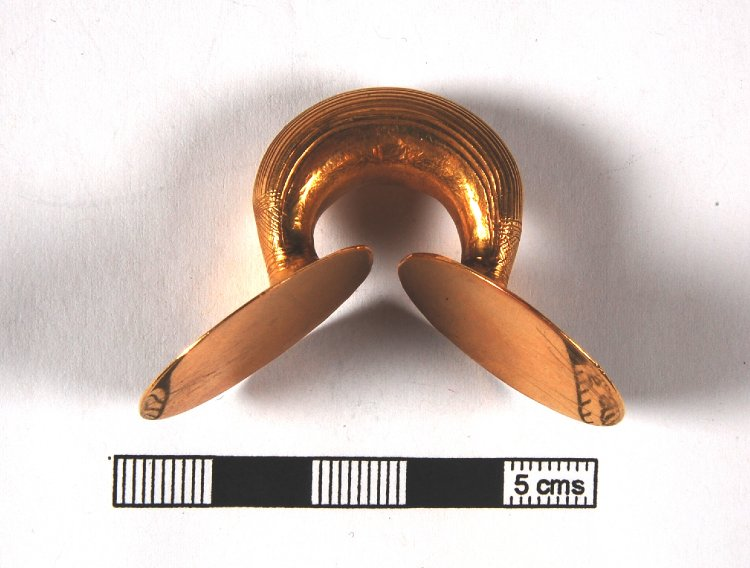
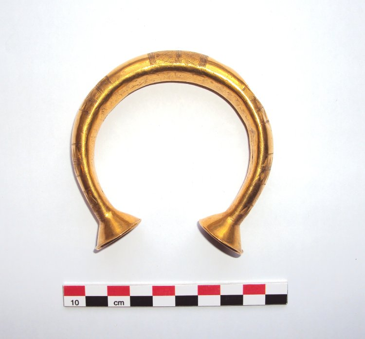
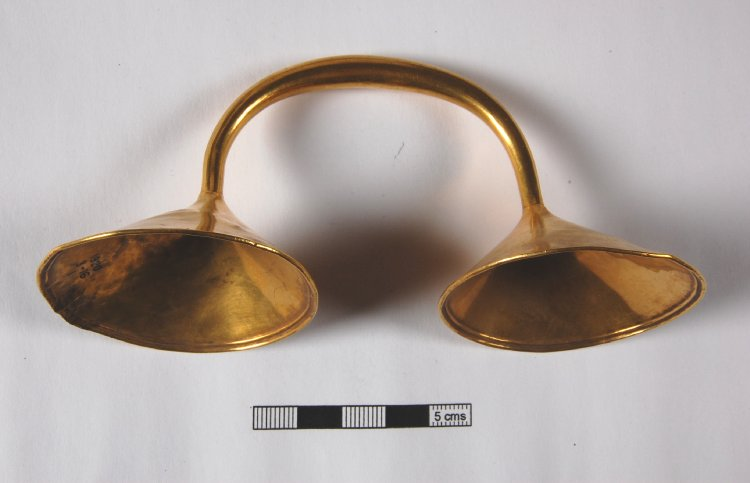
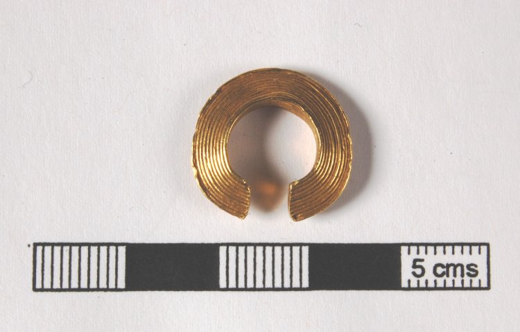
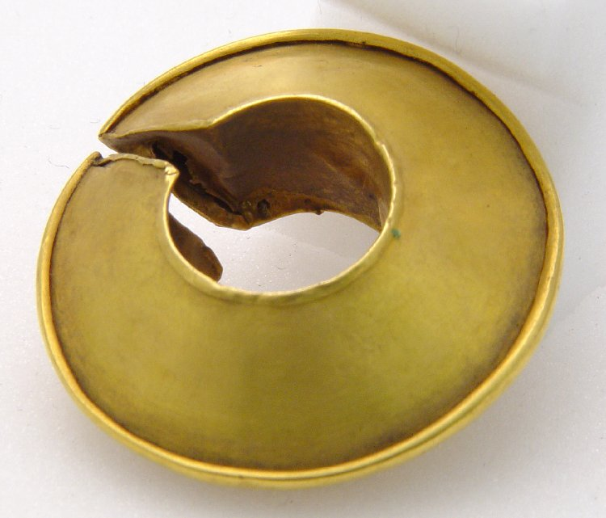
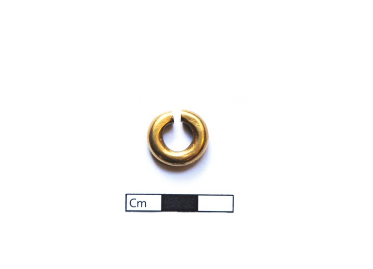

Bronze Age ornaments form a major category of metal artefact. Those made of gold are some of the most captivating prehistoric objects known to us. They are probably the most personal objects surviving as they were worn on the body and, as is still true today, were a daily and ever-present signaller of identity, status and an individual’s personality.

The term ornament is rather cumbersome and old fashioned, but by this we essentially mean jewellery. This includes rings, bracelets, necklaces, earrings, objects worn in the hair, dress pins and other types of clothes fasteners. As the ornament data from the Bronze Age Index is about to be put on the MircoPasts website, we thought it would be useful to give a quick introduction to this object category.

Most Bronze Age ornaments are often believed to date within the Middle Bronze Age, c. 1400-1150 BC. This was even known as the ‘Ornament Horizon’, although now other terms are preferred (See [‘Later Prehistoric Britain’](https://blog.micropasts.org/2014/06/20/later-prehistoric-britain-the-development-of-bronze-age-metal-objects/) post by Neil Wilkin and Jennifer Wexler, below). Generally speaking, Middle Bronze Age bronze objects date to the Taunton period (1400-1250 BC), whereas Middle Bronze Age gold dates slightly later to the Penard phase (1300-1140 BC). There are only a small number of ornaments dated to the next 200 years, although we should assume that they were still used. The last 150 years of the Bronze Age (950-800 BC) saw a huge increase in ornament deposition.

Recent and ongoing work by Ben Roberts (2007) on Middle Bronze Age ornaments has done much to enhance our understanding of these objects. His work with colleagues at the British Museum also includes information and fantastic pictures of all European Bronze Age gold objects in the museum, available online at:

[http://www.britishmuseum.org/research/online_research_catalogues/bag/bronze_age_gold.aspx](http://www.britishmuseum.org/research/online_research_catalogues/bag/bronze_age_gold.aspx)

Scrolling through these images provides a breathtaking insight into what some people were wearing in the Bronze Age, and the technical ability of Bronze Age smiths.

Middle Bronze Age ornaments are often large and would have been awkward to wear. This includes the [‘Sussex Loop’](http://sussexpast.co.uk/learning/learning-at-lewes-castle/prehistory-what-is-it/sussex-loop-bronze-age) bracelets and [Quoit Headed](http://finds.org.uk/bronzeage/objects/pins) pins, whose circular head could reach 15cm in diameter. Other dress pins are over 30cm in length. Clearly in the Middle Bronze Age people suffered for their fashion!

I have recently undertaken work on Late Bronze Age ornaments. This was for my Masters thesis at Cardiff University. A focus of this was on bracelets, and I have created a new typology that has shown some interesting regional patterns. I have also compiled a catalogue of all known Late Bronze Age ornaments, and analysed patterns in the information.

This has firstly demonstrated that there are many more ornaments dating to this period than is usually appreciated. So far at least 1100 objects date to c.1150-600 BC, of which c.770 belong to the Ewart Park phase of c.950-800 BC. This primarily includes objects made from gold and bronze, but also amber, jet and shale.

These objects are not as large and ostentatious as those in the Middle Bronze Age. They are dominated by a range of pins and bracelets, but there are also more unusual objects made from gold that we don’t know exactly how they were used. This includes small [‘lock-rings’](http://finds.org.uk/bronzeage/objects/lock-rings) and [‘penannular rings’](http://finds.org.uk/bronzeage/objects/penannular-rings). These usually have a gap in their circumference, so I like to think they were worn as earrings after a pierced ear has been stretched to allow for their width. However, not all have these gaps, so there is still debate as to their use. Another idea is that they were used to help tie up clothing or hair. Other unusual gold objects include so-called [‘dress fasteners’](http://finds.org.uk/bronzeage/objects/dress-fasteners) and [‘sleeve fasteners’](http://finds.org.uk/bronzeage/objects/sleeve-fasteners). These are primarily found in Ireland, but do also appear in Britain. These are both of a very similar form to some bracelets dating to the same period. There seems to be a continuum in the size of these types of objects, with each type merging into the other. As these objects are almost always found as single finds or in hoards, context is not very helpful in understanding how they were used. The only find that is vaguely useful are the two gold penannular rings found with a cremation at Mucking North Ring, Essex (Bond 1988, 14). If anyone has ideas as to how these objects may have been used, please leave a comment!

One of the observations that came up in my research is that there are certain patterns in ornament deposition. Firstly, single ornaments very rarely occur alone in hoards. There are also no hoards that contain non-metal ornaments – amber, shale and jet – that do not also contain metallic ornaments. Bracelets also seem to occur only in even numbers or pairs in English hoards. The significance of this pairing is heightened by the few burials we have associated with bracelets. Of the four burials that are accompanied by bracelets, three of these consist of pairs.

Pins are also subject to depositional planning. Although they are occasionally found in hoards, they generally seem to be systematically excluded from these contexts. In fact, they are the only type of object that are more common on settlements than in hoards, and are the only metal object that you might realistically expect to find during the excavation of a Late Bronze Age settlement. Most of these do seem to be genuine accidental loses on settlements. This suggests that some single finds may in fact come from settlements waiting to be excavated!

All this evidence helps to demonstrate that the metalwork corpus that we have is highly selective. We should not assume that it is representational of the range or quantity of material actually present in the Bronze Age. By in large, the content of each hoard reflects only a part of the specific cultural circumstances that led to its deposition; objects that were not deemed relevant to depositional activities could be indefinitely remelted and recycled and never enter the archaeological record. Due to this, we should not exclude the possibility that some bronze present in modern objects was originally smelted and circulated in the Bronze Age!

 

A large number of objects, especially those of gold, have only recently come to light as part of the [Portable Antiquities Scheme](http://www.finds.org.uk) Murgia and Roberts *forthcoming*). This has only been possible due to the excellent collaboration that is happening between members of the public, especially metal dectectorists, and archaeologists. Input from the public like this is driving research forward. My catalogue has yet to include the objects in the Bronze Age Index, and no doubt the work undertaken by MicroPasts volunteers to digitalise this resource will enhance our understanding of Bronze Age jewellery. Thank you, and I look forward to seeing the results!

Alex Davies

Cardiff University

## References

* Bond, D. 1988. *Excavation at the North Ring, Mucking, Essex: a Late Bronze Age enclosure*. Chelmsford: East Anglian Archaeology 43.
* Murgia, A.,Roberts, B. W. & Wiseman, R. (2014). ‘What have metal-detectorists ever done for us? Discovering Bronze Age Gold in England and Wales *Archeologische Korrespondenzblatt*
* Roberts, B. W. 2007. ‘Adorning the Living but Not the Dead: Understanding Ornaments in Britain c.1400-1100 cal BC.’ *Proceedings of the Prehistoric Society* 73. 137-67.