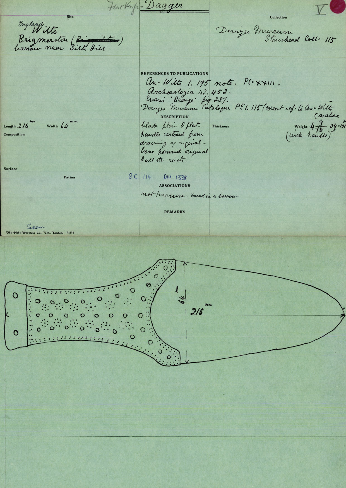

In the process of digitising the Bronze Age Index, we have come across a small collection of Index cards recording artefacts in the Wiltshire Museum (formerly the Devizes Museum: <http://www.wiltshiremuseum.org.uk/>). This was recently written up by Culture24 [(http://www.culture24.org.uk/history-and-heritage/archaeology/art513504-bronze-age-finds-from-barrow-cemeteries-in-stonehenge-country-to-be-recreated-in-3d](http://www.culture24.org.uk/history-and-heritage/archaeology/art513504-bronze-age-finds-from-barrow-cemeteries-in-stonehenge-country-to-be-recreated-in-3d)), highlighting our ongoing collaboration with the Wiltshire Museum as we continue to research this collection.

 

These cards illustrate over a hundred bronze objects found largely during 18th and 19th century antiquarian investigations of various barrow groups in the regions surrounding the monumental landscapes of Stonehenge and Avebury. These include some of the famous barrow cemeteries found in Salisbury Plain (pictured above), such as the Lake Down Group, Normanton Group (Bush Barrow), and Amesbury Curses, for example:

 

Finds from less well-known sites, such as Silk Hill (below) near Durrington, are also represented, with the individual cards compiling the early publication record for each object:

 

 

As we continue to expand our research into the BA Index, we are planning to connect into new research and developments in British archaeology. For example, the crutch-headed bronze pin pictured (above, and close-up below, right) from Silk Hill, is an infrequent type found in both ‘Wessex 1 and 2’ graves during the later part of the Early Bronze Age. Recent research (S. Needham, M. Parker Pearson, A.Tyler, M. Richards, M. Jay, *Antiquity J. 84 (2010)*) reassessing antiquarian records and collections at the Wiltshire Museum, showed that another crutch-headed pin (pictured below, left) from West Overton G1 barrow, near Avebury was found with a radiocarbon-dated burial, allowing us to date the Silk Hill burial with a similar pin to around 2020-1770 cal BC.

 

Casual finds from the antiquarian record are also recorded in the Bronze Age Index, including artefacts which have now unfortunately been lost (below) or not well-research.

 

While some of these cards are now out of date information, they do offer us an excellent picture of the early antiquarian discoveries found in the region over 200 years ago, especially those of William Cunnington and Sir Richard Colt Hoare. Many of these sites would have never been recorded if not for their hard work!

Further collaboration with the Wiltshire Museum, and the integration of the digital resources available via their collection portal (<http://www.wiltshireheritagecollections.org.uk/>) will allow us to update and expand our records as we continue to expand our research. This information will eventually be integrated into the PAS (finds.org) database, making it one of the largest records of prehistoric objects in the UK and the world!

*Many thanks to the Wiltshire Museum and Culture24 for collaborating with us on this collection!*