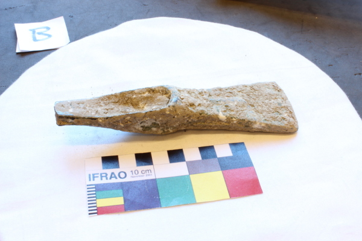
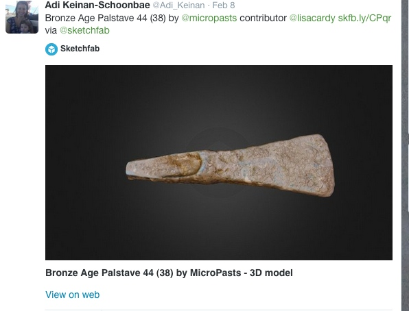

I’ve been a MicroPasts contributor for around two months now, a good time to write this post about why I wanted to be one of the ‘sourced’ crowd and what I’ve got out of it so far. To begin with, here’s *my* brief summary of MicroPasts: it’s a web-based collection of archaeological projects that anyone can get involved with. The MicroPasts site hosts lots of content, some of which I’ll return to later, but let me start with ‘crowdsourcing’.

The MicroPasts team have produced a number of applications that can be worked on through a web browser. All I needed to do to get started was register some basic details and follow a tutorial about what I needed to do with some handy hints and tips. Typical volunteer activities or ‘applications’ include transcribing digitised hand written British Museum index cards and editing photographs of Bronze Age objects to create outlines (or ‘masks) that can then be processed to create 3D models of the original objects. You can see the latest set of applications [here](http://crowdsourced.micropasts.org/app/category/featured/). Whichever MicroPasts application you decide (I particularly enjoyed drawing lines around Bronze Age objects….) the overall outcome is the same: your manual input feeds into a growing body of openly available digitised data that anyone can access via their computer. If the warm feeling inside that ‘doing your bit’ gives you isn’t enough, you also get a name check in the [Community](http://crowdsourced.micropasts.org/account/) area. If you want to read more on why open data is so important, even more so for archaeology, have a look at this [post](https://blog.micropasts.org/2014/01/31/hello-micropasts-thrilled-to-meet-you/).

 

After graduating in Archaeological Science (a long time ago) and a few unsuccessful attempts at an archaeology-based career, I did an MSc in Information Science. This was with the intention of working in the heritage sector, but I have been working as a librarian ever since. I want to shift my career back towards archaeology, but without losing the skills I’ve gained in the library profession, especially those around digital archiving. Archaeology has a long history of openness and sharing (the first OA ejournal was ‘Internet Archaeology’, way back in 1996) and I knew there’d be lots of opportunities to volunteer on digs. However I wanted to focus on what was possible digitally, even during my degree I’d always preferred the post excavation side of archaeology. I’d been considering this for a while, having been very inspired by the 2012 conference ‘Digital Engagement in Archaeology’ and following some key contributors on Twitter ever since I’d been aware of MicroPasts when it launched at the end of 2013.

Having completed some MicroPasts applications I decided to get in touch with Chiara about doing something beyond working on the web-based applications, something substantial to put on my CV. After some emailing and meeting up with Chiara and Adi, I joined a team of other contributors creating 3D models of Bronze Age artefacts from the outputs of the photomasking application. With lots of help and advice from the MicroPasts [forum](http://community.micropasts.org/), so far I’ve produced two 3D models of [palstaves](https://sketchfab.com/models/39a7e84572274b37a09ec9a10c10394f) (a type of a Bronze Age axe). At the time of writing, I am just about to start working on my 3rd model.

 

I’ve recently completed two application forms, one for a job and one for a research post, in archaeological areas, both benefitting from enhanced archaeological credentials on my CV from my involvement with MicroPasts. So now there’s more open research data out there for anyone who’s interested in Bronze Age artefacts (Robert Kaleta is planning on using the models as part of his [PhD research](https://blog.micropasts.org/2014/11/18/phd-project-analysis-of-middle-bronze-age-palstaves/)) and for me, some more skills and experience to boost my career moves.

There’s been a huge rise in community and public archaeology and I think MicroPasts is perfect for people like me who aren’t employed in the archaeology sector and want to get involved in something other than excavating. Presumably this is also true of the 800 registered users in the MicroPasts community ‘crowd’ working on the applications. But how does archaeology benefit? You can see the latest outputs in the [data centre ](http://micropasts.org/data-centre/): there are now more than fifty [openly available](https://sketchfab.com/micropasts) 3D models of Bronze Age objects that didn’t exist before the MicroPasts platform launched and any researcher can view digitised versions of index cards without having to travel to the British Museum.

*Lisa*