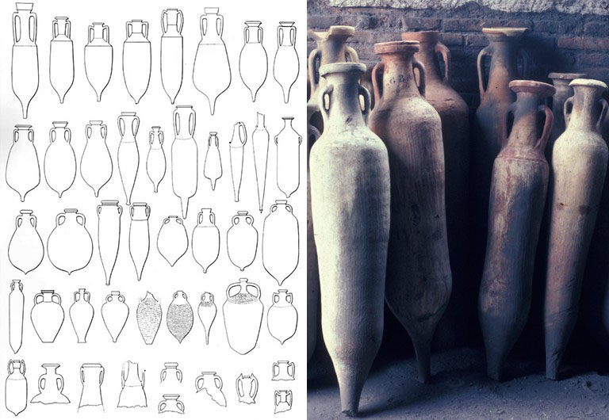
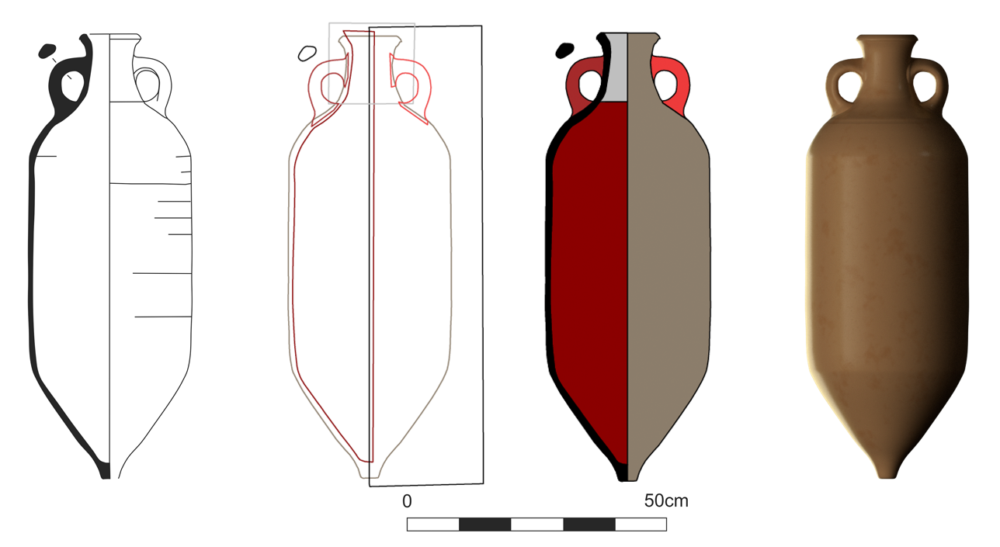

Carefully-made drawings have been a fundamental way that archaeologists have recorded their finds since the dawn of archaeology as a formal academic subject at the end of the 19th century. As time has gone on, these drawings have become ever more technical in their style and standardised in their components. Sadly, this means there are fewer opportunities these days for archaeological illustrators to show off their personal artistry in making such drawings (here’s [a great example](https://blog.micropasts.org/2014/06/20/later-prehistoric-britain-the-development-of-bronze-age-metal-objects/ "Example of early drawing")). However, in contrast, this attention to standardisation means the archaeological drawings are now more easily compared to one another. A typical feature of archaeological artefact drawings today is the depiction of what an object looks like ‘in section’ or ‘in profile’. For something like a cup, bowl or storage jar, the drawing would show the thickness of the vessel body and the shape of its interior, (see below, figure 2a).

People have long used such drawings as a basis for characterising the shape of containers and other vessels found in the archaeological record, not least because such metrics can useful for dating particular vessels to particular time periods (and placing them in a ‘typology’ of vessel shapes). Furthermore, for certain vessel types, volumetric capacity is of particular interest (how much they can hold), both as a guide to how much people were cooking, storing or transporting in one go and as a way of perhaps understanding weight and capacity systems in the human past (e.g. discovering the prehistoric and historic equivalents for standard liquid measures such as our modern ‘pint’ or ‘litre’)

 

All of the above obsessions in archaeology come to a head for those who specialise in studying vessels such as ‘amphoras’ (figure 1). [Virginia Grace](http://trowelblazers.com/virginia-grace-stamp-collector-and-artefact-protector/ "Virginia Grace bio") was one of the early amphora researchers who best described the surprisingly wide range of advantages that this specialised pottery form offered for shipping liquid commodities such as olive oil and wine (amongst others) around the Mediterranean. To paraphrase and extend her comments, an amphora is a clay two-handled jar whose design is specialised for maritime transport. Its elongated, symmetrical shape could be fashioned on a potter’s wheel which facilitated the production of large numbers of regular shapes. The common choice of a pointed-base made many amphoras less vulnerable to breakage and allowed them to be stacked in multiple layers in the holds of Mediterranean ships (e.g. with the bases of one layer sitting in the space between the vessels below). They could also be placed individually in stands, arrayed in groups on racks, leant against one another on wharves and in warehouses, or half-buried on the beach whenever boats stopped in more isolated coastal locations. The design could also be carried in panniers, slung from ropes or hoisted onto the shoulder of a human porter, while an amphora’s narrow neck was perfect for sealing with a stopper and being rendered air-tight with a covering of clay or lime. The term amphora itself implies ‘two-handles’, and the combination of these two sturdy points of purchase, plus the pointed-base as a third, meant that these vessels could be easily carried by porters or controlled for pouring. It is no surprise therefore that amphoras have a really deep Mediterranean history stretching right back to at least the Middle Bronze Age (if not before) and continuing right into the Medieval period and despite rising competition from alternative transport forms such as the wooden barrel (more information on Mediterranean container history [here](http://www.jstor.org/stable/10.1086/677034)).

For over a hundred years, archaeologists have classified different amphoras into different types based on their overall shape, surface designs (if any) and type-of-clay and these typologies have been both useful both as a dating device and as a way of understanding possible changing transport priorities through time. In the past, both producers (of amphoras and/or their liquid contents), merchants and consumers were obviously interested in knowing the volumetric capacity of an amphora (and standardising this where possible) so they were keen to standardise the shape and be able to calculate its capacity wherever possible. It was also tempting to produce eye-catching shapes and decoration that might signal the contents came from an exotic part of the Mediterranean and/or a particularly reputable source (just as there are efforts to brand olive oils and wines today via their containers and labelling). Or producers and distributors might wish to foster designs that were well-adapted for handling by dockside workers and for surviving the misfortunes of long-distance sea travel in a shiphold full of other cargo. Regardless, amphoras show some really interesting changes in design over their 3,000+ year-old history and these changes also match in interesting ways wider changes in the nature of the Mediterranean economy, big geo-political shifts such as the rise and fall of the Roman empire and so on.

In terms of measuring amphoras, people have tried a host of different methods. They have taken simple measures such as the amphora height or width, but also complex ones such as the amphora’s centre of gravity when full, or its overall capacity (how much it could hold). The latter measure of volume can be derived directly by filling an intact example of an amphora with seeds, water, sealed bags of liquid, beans or polystyrene beads (amongst others!) or it can be estimated mathematically. In fact, mathematical estimation of volumes (and other properties) for curves, conoids, spheroids etc. has been a domain of science and engineering actively researched since at least Hellenistic and Roman times, with major figures such as Archimedes, Apollonius of Perga and Hero of Alexandria working on the problem (with the suspicion that symmetrical real-world objects such as amphoras or jars were sometimes on their minds: for example, see [here](http://archiv.ub.uni-heidelberg.de/propylaeumdok/564/1/11_14_vodolazhskaya_calculation.pdf "Early mathematics of amphora shapes")).

Computer-based methods for creating such a 3D ‘[solid of revolution](http://en.wikipedia.org/wiki/Solid_of_revolution "Solid of revolution")’ from a standard 2D archaeological line drawing have been around for at least couple of decades, but it is surprising that they have not been used more systematically. Through the help of many contributors on MicroPasts, we are therefore hoping to collect 2d and 3d models of much large numbers of container types so we can compare their shapes statistically, but also so we can explore other changing properties such as their volumetric capacity (how much they could hold and how consistent these measures are through time), centre of gravity when full or empty (important for how a human porter or a draft animal might handle them) or behaviour when stacked (e.g. where, and how frequently, they might break when bumping around in a ship’s hold).

[One of our current MicroPasts applications](http://crowdsourced.micropasts.org/app/amphs1/ "Crowd-sourcing amphoras") re-uses line drawings of amphoras made by Penny Copeland as part of a wonderful [web resource about Roman amphoras](http://archaeologydataservice.ac.uk/archives/view/amphora_ahrb_2005/ "ADS Resource on Roman Amphoras") developed by the University of Southampton and now maintained by the UK Archaeology Data Service. The goal is to enlist public help in digitising lines and polygons on top of the existing scanned drawings and thereby enabling both very good quality 2D and 3d models of these. Figure 2 shows an example of one of Penny’s original line drawings, as well as a crowd-sourced version, a clean 2d model derived from it, and finally 3d model (all using open source software and with some great help on the automated Blender part from Tom Haines: [post-processing scripts here](https://github.com/MicroPasts/MicroPasts-Scripts/tree/master/amphoraProfiles "Amphora processing scripts")). Once the crowd-sourced version is created the rest of the process is automatic and allows us to potentially compare a large number of amphora types. Hence, there are still plenty of important archaeological answers to be found in the amphoras and good reasons to enlist public help. If you have a spare moment, want to get some experience of GIS-style ‘vector digitising’ or just find these objects fascinating, then please [lend a hand](http://crowdsourced.micropasts.org/app/amphs1/ "Amphora crowd-sourcing")!