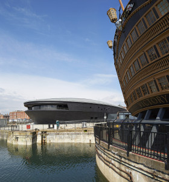
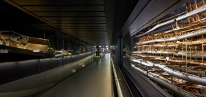
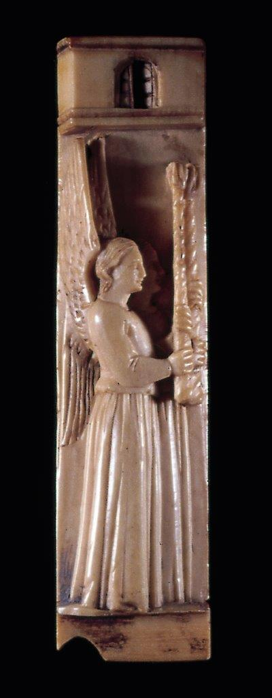
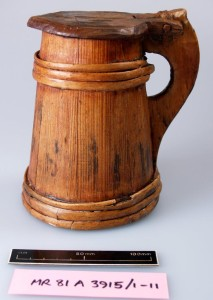
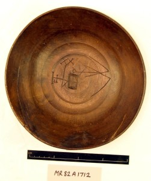

On Friday 22nd May, the Mary Rose Trust and MicroPasts teams launched a collaborative [3D photo-masking pilot project](http://crowdsourced.micropasts.org/app/photomaskingMaryRose/) on the MicroPasts crowdsourcing platform. The aim is to create 3D models for three of the museum’s artefacts. We are really grateful to MicroPasts collaborators for helping complete 37% of the application already (as of 29th May)! It is exciting to see people engaging with the collection online, and it will be interesting to discover how the 3D models are viewed, downloaded and used, once developed.

With the project now underway, we would like to take the opportunity to provide some background information on the [Mary Rose](http://www.maryrose.org), the Museum and the artefacts included as part of this first pilot project with MicroPasts.

The Mary Rose was a Tudor warship that sank during a battle with an invading French fleet near Portsmouth, on the South coast of England, in 1545. The hull and her contents were covered (and preserved) by the silts of the Solent. They remained there until they were rediscovered in 1971. Following one of the largest maritime excavations ever undertaken, the hull was eventually raised on 11th October 1982.

In May 2013 a new purpose built museum, that reunited the hull and thousands of her artefacts, was opened to the public. The hull, at the centre of this museum, is undergoing an air drying treatment. This is the final stage of her conservation, a process that has lasted over 30 years. In 2016, the air drying will be completed, the museum will be closed while the walls surrounding the hull are taken down and the museum will then be re-opened with amazing new views of the hull throughout the building.

The current MicroPasts 3D photo-masking pilot project is based around three of the artefacts that can be seen on display in the museum. These are:

### Bone angels

The bone plaque of two angels was identified as being similar to those made in the Northern Italian workshops of the Embriachi family who produced a variety of luxury objects such as mirrors, caskets and triptychs that incorporated a series of bone or ivory plaques with stained wood and horn.

### Wooden tankard with lid

The staved wooden tankard was one of the most complete tankards recovered during the excavations on the Mary Rose. It is interesting to note that oak, poplar, pine, beech and willow were all used in its construction.

### Beech wooden bowl

The beech wooden bowl is one of 30 recovered during the excavations and it has one of the more intricate set of markings on both the inside and outside. These are thought to denote its ownership.

The Mary Rose team