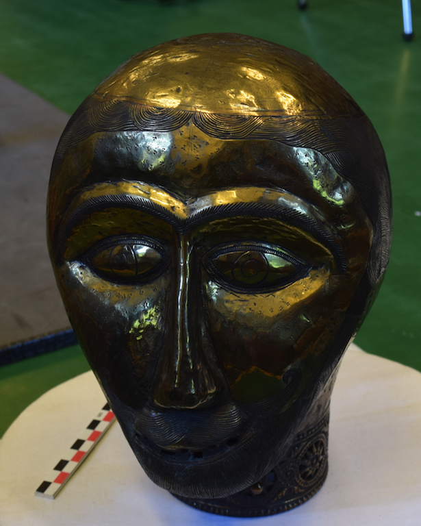
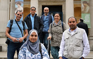
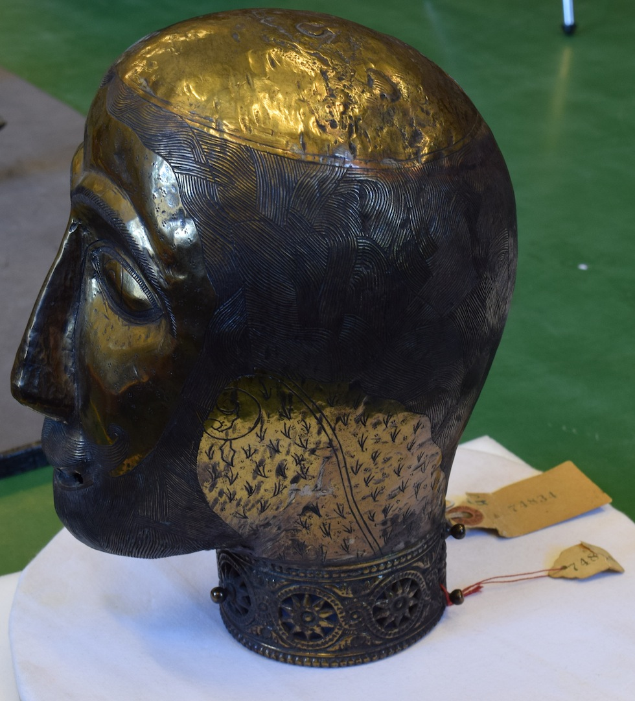

 

This September we were lucky enough to have a visit from a group of Egyptian scholars organised by the Egypt Exploration Society [(http://ees.ac.uk/news/index/322.html](http://ees.ac.uk/news/index/322.html)). The [Egypt Exploration Society ](http://ees.ac.uk)(EES) has been one of main crowd-sourcing collaborators, asking MicroPasts’ contributors to transcribe early 20th century excavation records from Amarna West and Amara, and we have now done 18 crowd-sourcing projects together with over 20,000 tasks completed! The Egyptian scholars were based at the EES’s London office for six weeks conducting research and training relevant to their research projects and working roles in Egypt, and in conjunction we ran a series of training sessions with them on crowd-sourcing, GIS, and 3D photography at the Institute of Archaeology, UCL and the Department of Britain, Europe, &amp; Prehistory (BEP), British Museum.

While preparing the 3D photography session (see[ https://blog.micropasts.org/2014/06/13/3d-modelling-via-sfm/](https://blog.micropasts.org/2014/06/13/3d-modelling-via-sfm/) for more information about our 3D photography technique) I asked [Georgi Parpulov ](https://independent.academia.edu/GeorgiParpulov)for ideas of some interesting Egyptian or related objects for possible photomasking. As the Project Curator for [*Empires of Faith* *Project*](http://www.britishmuseum.org/research/research_projects/all_current_projects/empires_of_faith.aspx), Georgi has been in the process of cataloguing all the Byzantine and Coptic objects in the British Museum’s collections from across the Byzantine world. Through his work Georgi has brought to light a mysterious relic head, which he describes to us here:

>“In the course of museum work, one sometimes hits upon objects which, while clearly not being modern forgeries, cannot be easily assigned an accurate date and geographic origin. This head is certainly the most vexing objects of this kind that I have encountered since I began working at the British Museum just about a year ago. The only piece of information that accompanied it was a paper label stating it was “Abyssinian”. Abyssinia is, of course, an old name for Ethiopia, and the head does bear a general resemblance to works of Christian Ethiopian art that I have seen. But what about the precise time of its manufacture? What purpose did it originally serve? Who is the man portrayed, and why is he bearded and tonsured? These are all questions that elude me. I am not a specialist in Ethiopian art; I know a couple of scholars who are, but they are equally puzzled by our head. The only way to solve the mystery would be to make the objects accessible for study to a wider circle of interested people, not least in Ethiopia itself. Three-dimensional photography of the head would allow one to see it fully without travelling to London. It is pretty to look at and will, I hope, not only arouse curiosity, but also bring some visual delight.”

We thought we might be interesting to photograph this mysterious head with the Egyptian Scholars, in the hope to bring more attention to this fabulous object for further research. Help us make the 3D model [here](http://crowdsourced.micropasts.org/project/ethiopia/)!

 

Jennifer from the MicroPasts Team in conversation with Georgi Parpulov, Project Curator: Empires of Faith, Middle East Department, British Museum. Many thanks to the EES and the Egyptian scholars for their help with the project!