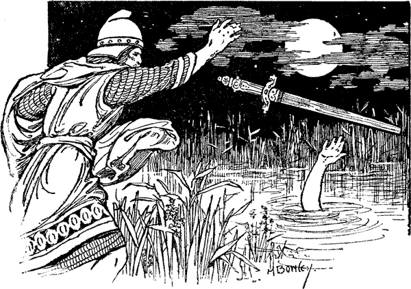
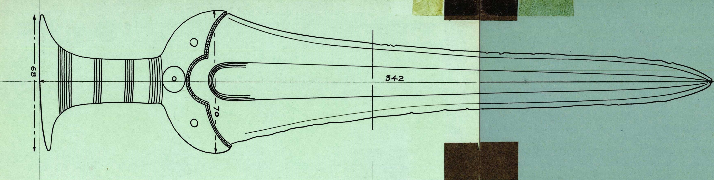
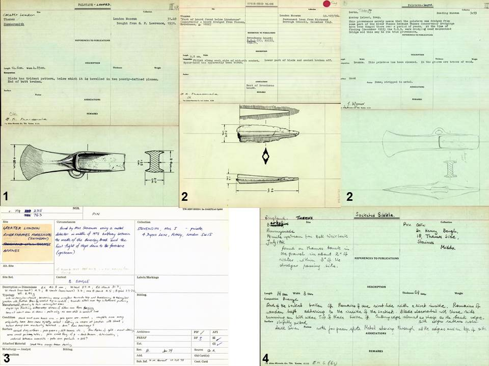
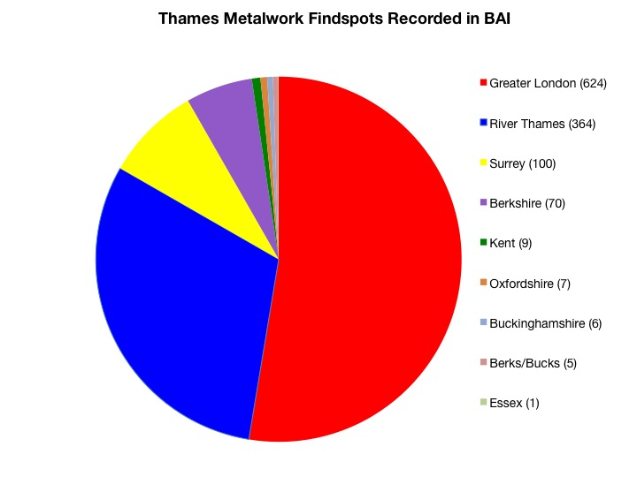
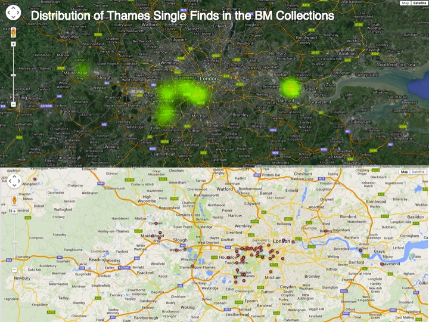
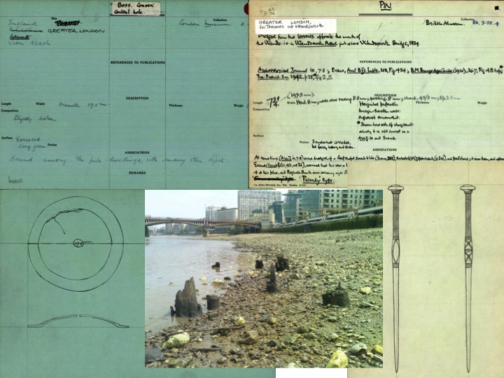
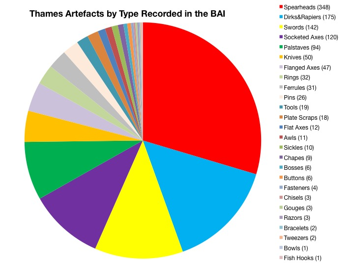
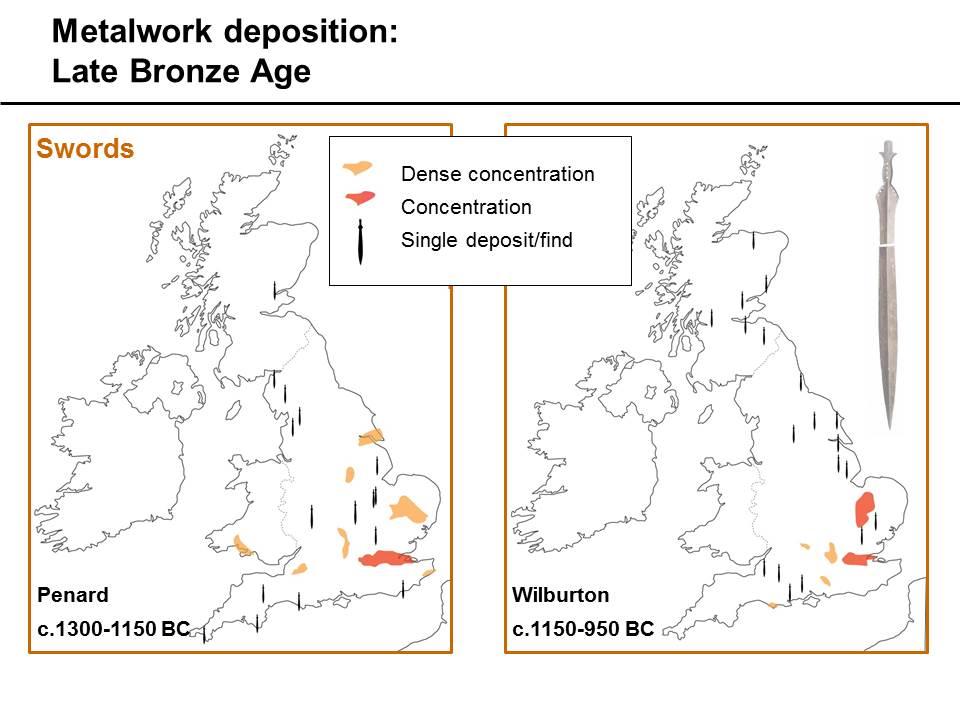
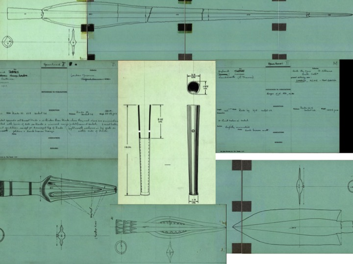

Our penultimate [Bronze Age Index project](http://crowdsourced.micropasts.org/project/ThamesSwords/) focuses on Bronze Age swords from the River Thames. Finds from the Thames and other watery locations in Britain and Northern Europe have fascinated scholars for many years, and recent excavations at [Must Farm](http://www.mustfarm.com) and [Flag Fen](http://www.vivacity-peterborough.com/museums-and-heritage/flag-fen/) show the incredible importance of riverine environments to prehistoric peoples. In a sense, Thames finds have been central to the study of later prehistoric Europe over the last hundred years, and there have been a huge amount of studies (see references below) dedicated to the topic, in particular on the increasing deposition of weapons (spearheads, dirks, rapiers, swords) from the Middle Bronze Age onwards (Bradley 1990: 99, 108-109). The idea of depositing weapons in water very much resonates with our popular cultural history. Folk stories and myths of a legendary past often feature the act of throwing costly and beautiful items into the water as both a sacrifice and an offering, most famously depicted in the story of King Arthur’s magical sword Excalibur being returned to the Lady of the Lake (illustrated above), with these stories possibly reflecting [echoes of ancient practices](http://traumwerk.stanford.edu/archaeolog/2008/02/celtic_swords_and_arthurs_lady.html).

The River Thames was famously described as ‘Liquid history’ by the 19th century MP [John Burns](https://en.wikipedia.org/wiki/John_Burns), and its importance cannot be underestimated as both a natural boundary and, perhaps, the [‘longest archaeological site’](http://www.archaeology.co.uk/articles/features/liquid-history-excavating-londons-great-river-the-thames.htm) in the UK (York 2002, Cohen 2010). What can the Bronze Age Index (BAI) tells us about Bronze Age metalwork deposition in the River Thames and the collection history of this material? We have over 1,200 records of artefacts connected to the Thames recorded in the Index. Largely it is an antiquarian collection relating to the numerous artefacts recovered from the Thames during the 19th and early 20th century, which were often found by workmen in the course of dredging and the building of bridges and locks. Many of these objects were acquired by private collectors, who often paid handsomely for high quality display pieces but rarely recorded the exact find spots and circumstances of recovery (Cowie &amp; Eastmond 1997: 88).

We find four notable types of cards related to Thames finds in the Index:

1. Collectors of Thames antiquities, most notably [George Fabian Lawrence ](http://ahistoryblog.com/2013/11/19/george-fabian-lawrence-aka-stoney-jack-1861-1939-items-of-interest/)the Inspector of Excavations for the London Museum who was very active in the recovery &amp; recording of river finds (he was commonly known as ‘Stony Jack’ to London’s workmen). He produced the first catalogue of archaeological material from the river in 1929. The collections of Layton, Greenwell, and Crooke also feature extensively in the records;
2. Smaller and regional museum collections, but the majority seem to be objects either in the British Museum’s or London Museum’s (now Museum of London’s) collection;
3. Private collections, which are especially important as these might not be recorded anywhere else.
4. Pre-PAS metal-detecting finds, which also might not be recorded anywhere else. Metal-detecting is now closely controlled along Thames foreshore, so these older records might give offer us some key insights into the foreshore record.

Many of the cards contain unique and extensive data about the artefact’s record, which in some cases indicates that its provenance to be connected to another find spot based-on dredging activity. We are still digitising and going through the records, but I wanted to go through some of the preliminary patterns we see in the Index records.

The pie chart above shows the regional distribution of Thames metalwork find spots recorded in the Index. As we can see, Greater London by far represents the largest number of records. Most of these records would be connected to the significant dredging works undertaken between 1895 and 1900 ([Port of London Authority](http://www.pla.co.uk/History)). A second capital dredging campaign concluded by 1928, during which some 37 million cubic yards were excavated. There are a number of unprovenanced sites recorded as simply coming from the ‘River Thames’ without exact find spots, though related information seems to indicate that most of the artefacts would have come from London in connection again to dredging and bridge building activities.

We have smaller but significant groups of records from Berkshire and Surrey as well, many of these coming from the [Thames Water Collection](http://www.readingmuseum.org.uk/collections/archaeology/thames-water-collection/) collected by Thames Conservancy Board during dredging of the non-tidal part of the river up the Teddington Lock and donated to the Reading Museum in 1996.

Looking at a smaller sub-set of data of 249 records of Thames Single Finds in the [British Museum’s Collections](http://www.britishmuseum.org/research/collection_online/search.aspx), we can see in the map (above) that the general distribution of find spots with clusters in London (especially West London), London Docklands (representing the general ‘River Thames’ finds), and Maidenhead/Bray in Berkshire.

Looking closer at the London find spots represented in this data, after unprovenanced ‘River Thames’ finds, we have highest concentration of finds coming from Battersea and the Richmond and Wandsworth districts of West London. David Field (1989) famously commented that the “collections of prehistoric artefacts from the river in west London represents one of the most impressive concentrations of archaeological material in the British Isles”. Finds seem to cluster especially around Kingston Bridge, Wandsworth Reach, Hammersmith, Isleworth, Putney, Chiswick, Teddington, Twickenham, and Barnes, with many important sites represented in the records.

Many cards feature small finds and ornaments, as shown here, recording Ivor Noel Hume’s 1955 excavation of Late Bronze Age timber &amp; wattle platform at Syon Reach near Isleworth, Richmond, which was unfortunately washed-away by a passing ‘pleasure boat’ while they were in the process of recording it! The [Thames Discovery Programme ](http://www.thamesdiscovery.org/riverpedia/isleworth-riverpedia)have recorded ‘a significant concentration of Bronze Age material, (possibly representing a trading centre or deliberate votive deposition)’ at Isleworth, possibly in some resemblance to the [Vauxhall ‘bridge’ structure](http://www.thamesdiscovery.org/frog-blog/london-s-oldest-find-discovered-at-vauxhall) dated to the Middle Bronze Age. Many records are also connected to the tributaries of the Thames, and particular concentration from the ‘mouth of the River Wandle’ just above Wandsworth Reach/Bridge.

Looking more closely at artefacts recorded in the Index, we have 26 categories of artefact types from the Thames that are so far represented in the Index, as shown here. At the moment we have many more spearheads than anything else, but dirks &amp; rapiers, swords, socketed axes, palstaves, and knives all figure prominently. This pattern is repeated throughout studies of Thames material, with not only a massive record of weapons found in the Thames from the MBA onwards but the concentrations of sword deposition (pictured below) by the LBA clustering in the Thames Valley and Fenland of East Anglia, with relatively few deposited north of the Severn-Wash line.

How is this material being treated? York’s excellent [2002 study](http://onlinelibrary.wiley.com/doi/10.1111/1468-0092.00150/abstract) looked at both Index and published records in order to reassess the lifecycle and destruction of metalwork from the non-tidal Thames upstream of Teddington. She notes that in conjunction with the rise in weapon deposition there is also an increase in object destruction from the Penard (late MBA) to Wilburton phase (early LBA). Spearheads and swords were being treated differently than other objects deposited in the Thames, with destruction levels increasing over time, and it is clear that Bronze Age communities were perceiving these objects in a new and special light (York 2002: 88-89). Deposition may have been related to a display of wealth, social status, territory, celebratory after battle, or part of a burial or community ritual (for further discussion, see Bradley 1990).

We do not know for certain, unfortunately, the complete significance that throwing these special objects into significant bodies of water may have held for prehistoric peoples, we can only see their impact on the archaeological record and our understanding of the past. Hopefully, further research on this major resource will bring to light more information about these wonders from the deep.

In particular it would be key to connect this data to other museum’s collections &amp; archives, especially the Museum of London’s extensive [London Archaeological Archive &amp; Research Centre ](http://www.museumoflondon.org.uk/collections-research/laarc/)(LAARC) (which also has a complimentary antiquarian records related to Thames finds). Additionally a long-term goal would be to better integrate this data into the [Greater London Sites and Monuments Record ](https://www.historicengland.org.uk/services-skills/our-planning-services/greater-london-archaeology-advisory-service/greater-london-historic-environment-record/)&amp; other regional HERS, and look further at the connections between sites and objects recorded previously under the [Thames Archaeological Survey](http://www.thamesdiscovery.org/riverpedia/the-thames-archaeological-survey), &amp; currently by the [Thames Discovery Programme](http://www.thamesdiscovery.org).

This blog was based on a paper I presented on 20th April 2015 at the [*Tales the River Tells: Later Prehistoric Finds from In and Around the Thames* ](http://www.prehistoricsociety.org/events/event/tales_the_river_tells/)Conference run by the [Prehistoric Society](http://www.prehistoricsociety.org/) and the [Later Prehistoric Finds Group](https://sites.google.com/site/laterprehistoricfindsgroup/). Many thanks to [Michael Marshall](http://www.mola.org.uk/people/michael-marshall) (Museum of London Archaeology) and [Courtney Nimura](https://oxford.academia.edu/CourtneyNimura) (University of Oxford) for inviting me to speak at the conference.

**Bibliography**

- BRADLEY, R. 1990: The Passage of Arms (Cambridge University Press).
- BRADLEY, R. and GORDON, K. 1988: Human skulls from the River Thames, their dating and significance. Antiquity 62, 503–9.
- COHEN, N. 2010: Liquid History: Excavating London’s great river, the Thames. [Current Archaeology 244 (July 2010)](http://www.archaeology.co.uk/articles/features/liquid-history-excavating-londons-great-river-the-thames.htm)
- COLQUHOUN, I. and BURGESS, C. 1988: The swords of Britain. Prähistorische Bronzefunde IV.5. Munich: Beck.
- COTTON, J. 1999: Ballast-Heavers and Battle-Axes: The ‘Golden Age’ of Thames Finds. In Coles, A. and Dion, M. (eds.), Mark Dion: Archaeology (Black Dog Publishing), 58–71.
- COWIE, R. and EASTMOND, D. 1997: An archaeological survey of the foreshore in the Borough of Richmond upon Thames. London Archaeologist 8 (4-5), 87-93, 115-121.
- EHRENBERG, M.R. 1977: Bronze Age Spearheads from Berkshire, Buckinghamshire and Oxfordshire (Oxford, BAR Brit. Ser. 34).
- EHRENBERG, M. 1980: The Occurrence of Bronze Age Metalwork in the Thames: An Investigation. Transactions of the London and Middlesex Archaeological Society 31, 1–15.
- FIELD, D. 1989: Tranchet axes and Thames picks: Mesolithic core tools from the west London Thames. Trans London Middlesex Archaeol Soc 40, 18.
- NEEDHAM, S. 1988: Selective deposition in the British Early Bronze Age. World Archaeology 20(2), 229–48.
- NEEDHAM, S. and BURGESS, C. 1980: The later Bronze Age in the Lower Thames Valley: the Metalwork Evidence. In Barrett, J. and Bradley, R. (eds.), The British Later Bronze Age (Oxford, BAR Brit. Ser. 83 (i)), 437–70.
- O’CONNOR, B. 1980: Cross-Channel Relations in the Later Bronze Age (Oxford, BAR Int. Ser. 91 (i) and (ii)).
- PEARCE, S. 1984: Bronze Age Metalwork in Southern Britain (Princes Risborough).
- ROWLANDS, M.J. 1976: The Production and Distribution of Metalwork in the Middle Bronze Age in Southern Britain (Oxford, BAR 31).
- THOMAS, R. 1984: Bronze Age Metalwork from the Thames at Wallingford. Oxoniensia 49, 9–18.
- YORK, J. 2002: The Life Cycle of Bronze Metalwork from the Thames. Oxford Journal of Archaeology 21(2), 77-92.
