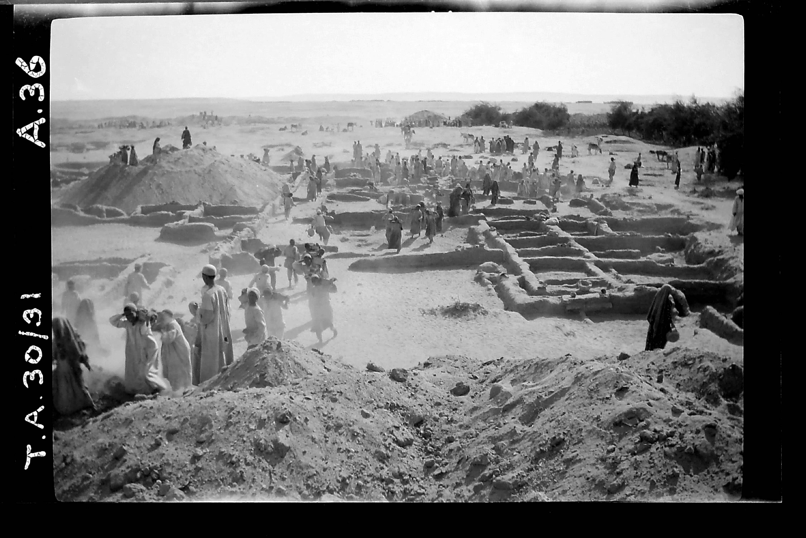
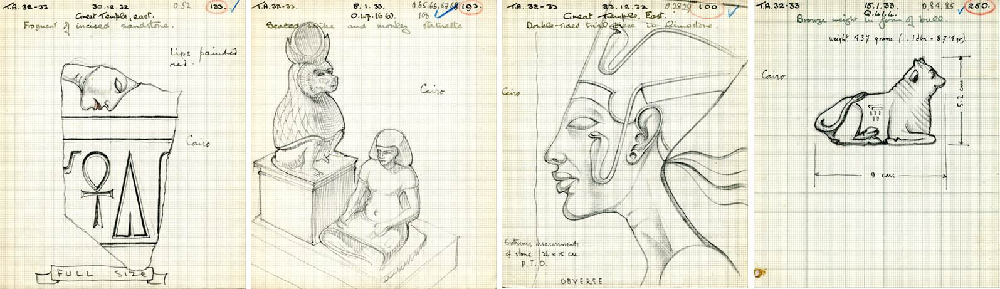
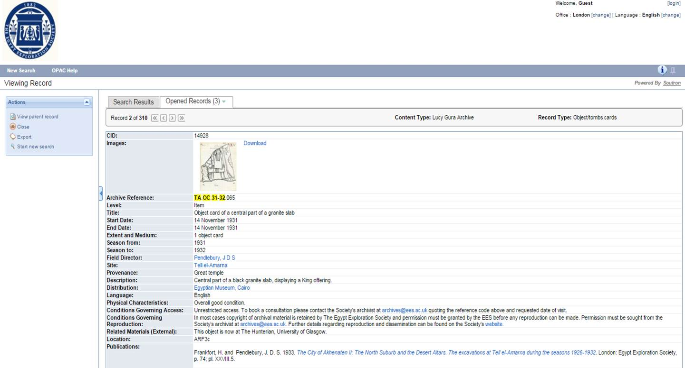

In 2015 the Egypt Exploration Society expanded its annual archive [volunteer programme](http://ees.ac.uk/archive/volunteerprojects.html) and made digitization its primary goal. Though the Society had already scanned a large number of archival documents and images, the [new referencing system](http://ees.ac.uk/news/index/264.html) developed for the archive during 2014 had to be implemented across its virtual collections. To this end, the Society’s collections of object cards were felt to present the greatest opportunity to test this system and provide valuable research material for teams still working in the field today. 

Object cards are those records created for each artefact discovered on site during a specific season, including vital information for researchers such as provenance, dimensions, material type, date of discovery, related negative numbers, and object reference number. The last of these was used to define the Society’s new archival referencing system and thus TA.OC.31-32.001 refers to the first object recorded for the 1931-32 dig season at Tell el-Amarna. All of this information was collected during the scanning and put into the file name of each digital record created.

 

*The Society’s excavations at Tell el-Amarna in 1931 under the direction of John D S Pendlebury. This same season was later written about by Mary Chubb (the Society’s Assistant Secretary and member of the expedition) in her memoir [Nefertiti Lived Here](http://ees.soutron.net/Library/Catalogues/CatView.aspx?id=9293). In this she also writes about making the object cards during the excavations and [the magic of discoveries](http://ees.ac.uk/news/index/302.html) made in the field.*

The Society’s volunteers made over 12,500 scans between January and July 2015 and covered collections from Amara West, Amarna, Armant, Buhen, Sesebi, and the Nubian Sondage Survey. While other collections of object cards still remain to be scanned, we turned in the second half of the year to cataloguing those records that had been digitised. For this MicroPasts became a crucial partner in collecting the required information from each scanned card. Users were provided with a template and asked to fill in the information from the card with the necessary data. Though challenges such as handwriting, non-standardised positioning of some of the information and occasional mistakes from the excavators themselves meant the information had to be checked on completion, the results obtained from MicroPasts’ dedicated online team of transcribers has been very impressive. As each card is transcribed more than once, any errors in the final data is easily spotted and rectified making transferring the records into the Society’s online archive catalogue much more efficient and reliable.

 

During summer 2015, the Society took on [two interns](http://ees.ac.uk/userfiles/file/15%252008%2520Summer%2520newsletter%2520WWW.pdf) to work on the new archive catalogue transferring the MicroPasts data into the system and adding any hyperlinks to known museum records for the artefacts. Within two months they were able to catalogue two seasons from Amara West and one from Amarna, at a much faster rate than had been possible without the MicroPasts data. Though we do not currently envisage finding the resources to continue this for all seasons, having the MicroPasts data available means that we are able to attach this information to file-level records higher in our database ensuring that it is still available to researchers while we work at producing item-level records.

 

*The Society’s new* [*online archive catalogue*](http://ees.soutron.net/Library/Catalogues/Search.aspx) *which includes some of the data created by the MicroPasts community of transcribers*

Since our interns completed their work at the Society, MicroPasts has continued to run crowd-sourced transcription projects on those object cards already uploaded to [our Flickr account](https://www.flickr.com/photos/egyptexplorationsociety/albums) and the results have come in much faster than we’d ever expected. The support and enthusiasm for our archival records from MicroPasts users has inspired us to continue making our records available via our Flickr feed. We extended our referencing system and digitization projects to our tomb record cards and volunteers have now succeeded in digitizing the entire tomb records from Sawama, Balabish, and Abydos. 

We hope to extend the MicroPasts transcription projects to include our tomb cards during 2016 and to continue making this information available to researchers around the world. Only by working cross-institutionally on projects such as this have we been able to access such enthusiastic and determined audiences – thank you MicroPasts for the opportunity, and thank you to your users around the world who have contributed to our archival records. 