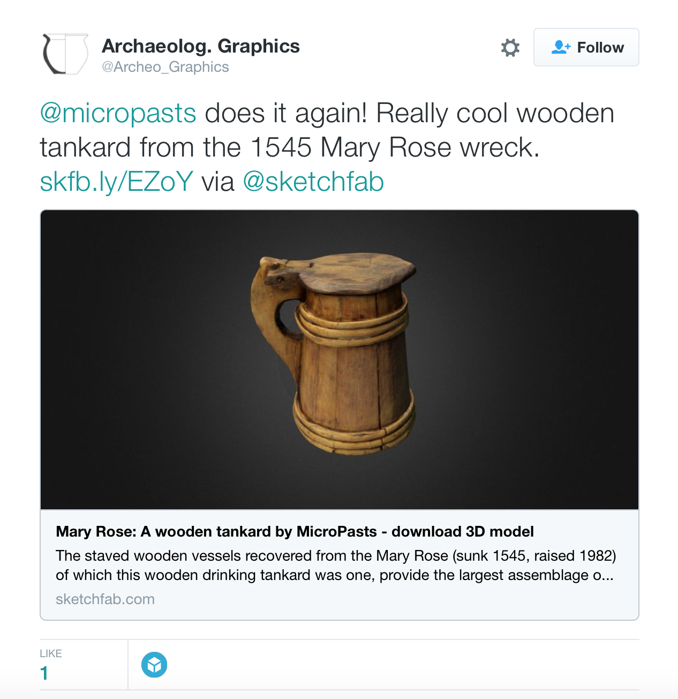
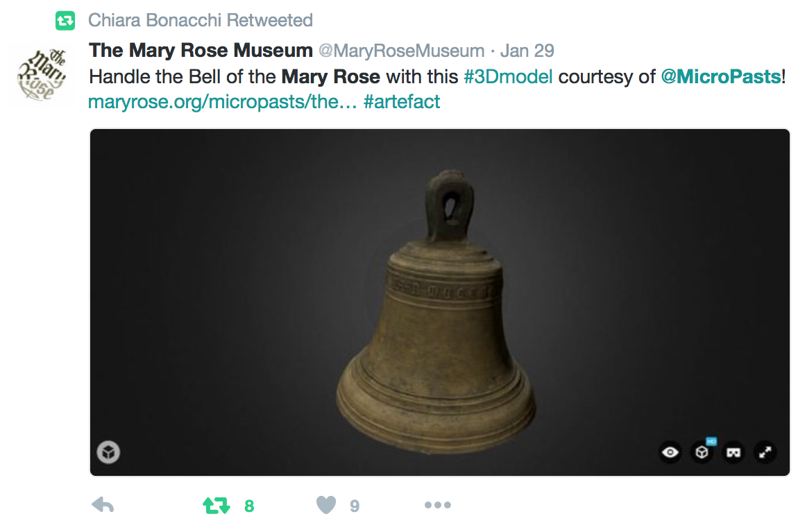
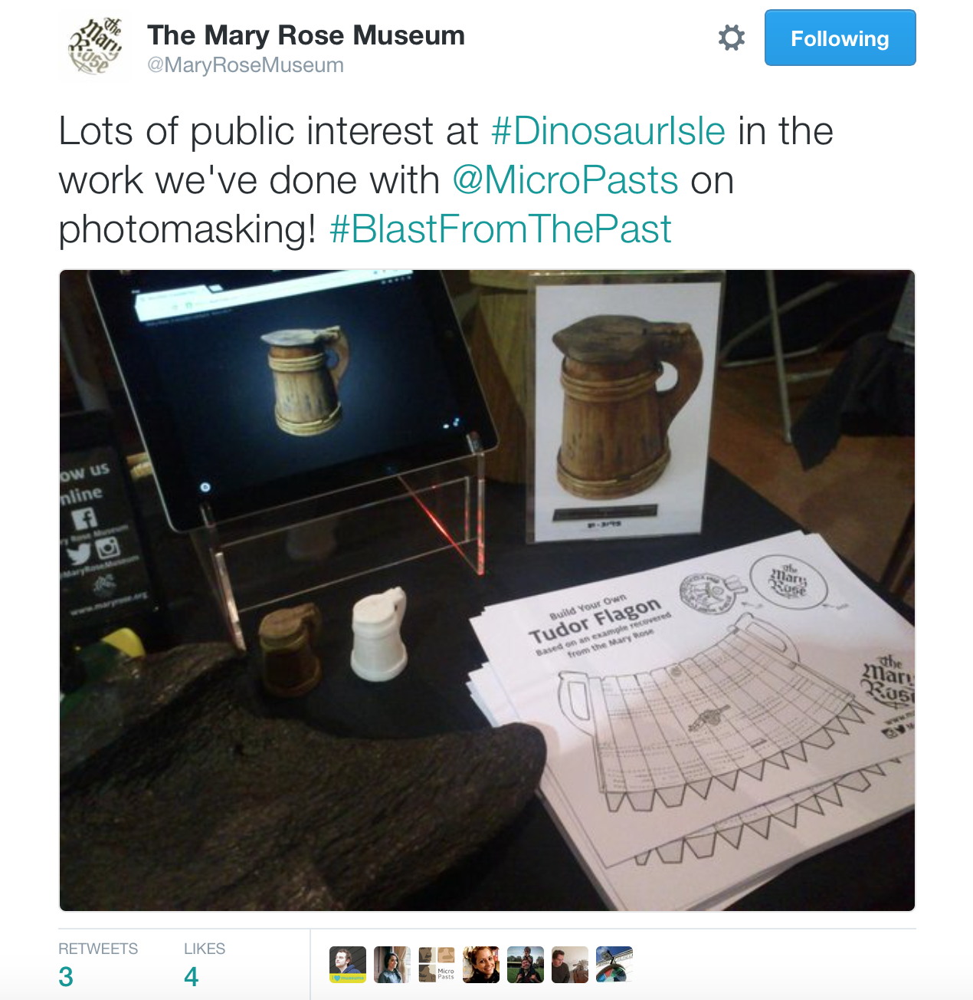
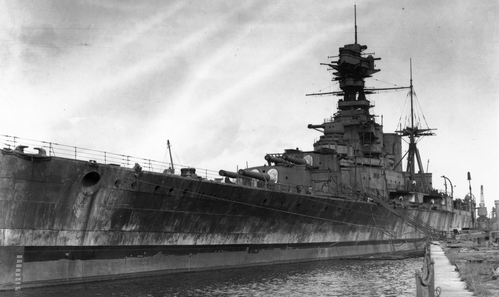
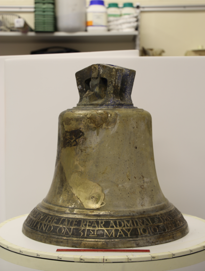

In March 2015, the team at the [Mary Rose Trust](http://www.maryrose.org/about-us/) met with [Chiara](http://www.ucl.ac.uk/archaeology/people/staff/honorary/bonacchi), who introduced MicroPasts and the various [projects](http://crowdsourced.micropasts.org/project/category/featured/) that the MicroPasts team had been involved in. The Mary Rose Trust team were hugely impressed with the passion of the [collaborators](http://crowdsourced.micropasts.org/account/) that had contributed to the online projects as well as the quality of the work that had been produced and the possibility of achieving a lot in a very short space of time!

With this in mind, a [pilot project](https://blog.micropasts.org/2015/05/29/the-mary-rose-mi%E2%80%A6aboration-week-1/) was prepared in which [3D photo-masking](https://blog.micropasts.org/2014/06/13/3d-modelling-via-sfm/) could be done on three artefacts recovered from the Mary Rose. This project started in May 2015 and within only a few months, models of each of the artefacts had been produced and uploaded to Sketchfab (a [wooden bowl](https://sketchfab.com/models/a56f2a11217b4c28b9300e5407337061), a [wooden tankard](https://sketchfab.com/models/8721cf07e6e04a578df9626e1eb54ce6) and an [angel plaque](https://sketchfab.com/models/d49c9aa42f1748e5a24ad9429e0af46b)). The [bell recovered from the Mary Rose](https://blog.micropasts.org/2015/12/11/i-was-made-in-the-year-1510/) was also added at a later stage and was similarly [prepared and uploaded by Hugh Fiske](https://sketchfab.com/models/ad399a15ec484cd18fdbe4f96c65c7d0), one of the MicroPasts collaborators.

 

As of May 2016, the 3D models of the artefacts have been viewed about 2,500 times. Although they represent a very small part of the Mary Rose collection, their introduction to a digital 3D space has offered exciting opportunities in developing the accessibility of the collection. So far, the models have been used for outreach activities undertaken by the Mary Rose Team, for preparing ‘replicas’ (via 3D printing) and as digital content for University student projects.

 

We are excited to see how the models of the Mary Rose artefacts are further utilised going forward, but, interestingly, our current collaborative project between the Mary Rose Trust and MicroPasts does not involve an artefact from the Mary Rose. Instead the item in question is the bell that was recovered from HMS Hood – a Second World War British battle cruiser that was sunk in 1941 (almost 400 years after the Mary Rose sunk in 1545!) by the German Battleship Bismarck, during the Battle of the Denmark Strait. In 2001 the wreck was located by Blue Water Recoveries with the ship’s bell found lying on the seabed away from the hull. In August 2015, [Paul G. Allen (co-founder of Microsoft) led an expedition supported by Blue Water Recoveries](http://www.theguardian.com/uk-news/2015/aug/10/bell-recovered-hms-hood-battleship-sunk-bismarck-1941) to retrieve the bell and, soon afterwards, the bell was sent to Mary Rose Archaeological Services for conservation.

 

The bell was presented to the HMS Hood when she was launched, in 1918, by the widow of Rear-Admiral Sir Horace Hood, great-great grandson of Sir Samuel Hood, after whom the ship was named. Sir Horace died at the Battle of Jutland on 31 May 1916, one of 1,026 officers and men who died in seconds when the battlecruiser HMS Invincible blew up and sank, and the bell is inscribed to that effect.

The Mary Rose Archaeological Services became involved due to the highly specialist expertise of the Mary Rose Trust conservators in the treatment of artefacts recovered from a marine environment. The [National Museum of the Royal Navy](http://www.nmrn.org.uk) were looking to prepare the HMS Hood Bell for display in the [*36 Hours: Jutland 1916, The Battle That Won The War* ](http://www.nmrn.org.uk/36-hours)exhibition (now open to the public at Portsmouth Historic Dockyard). The bell has been installed as a memorial to the 1,415 men who lost their lives when the ship sank in 1941.

Now you can help create models of the HMS Hood bell [before](http://crowdsourced.micropasts.org/project/HMSHoodpre/) and [after](http://crowdsourced.micropasts.org/project/HMSHoodpost/) conservation!

Alastair Miles and Chiara Bonacchi