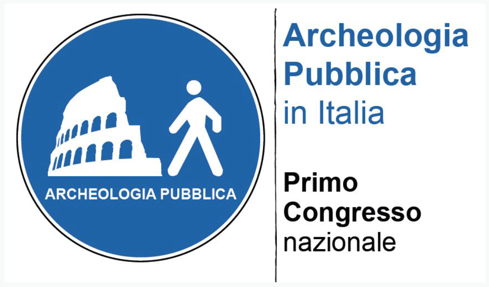
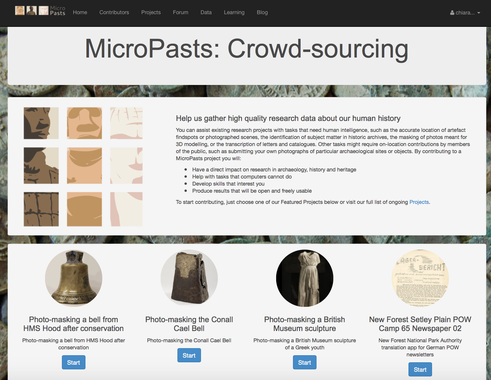
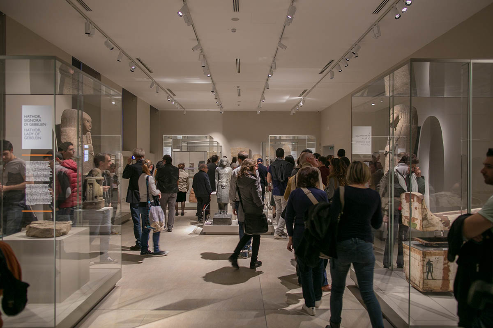
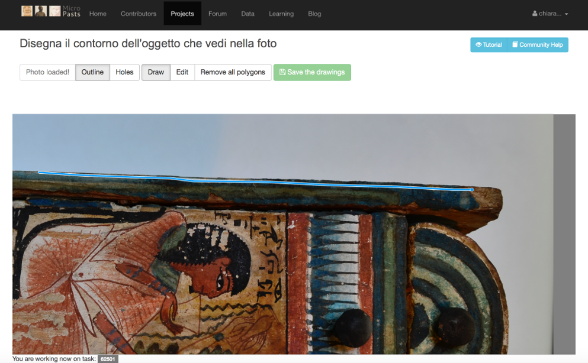

**Archeologia e Pubblico**. Comprendere come la ricerca e i risultati da essa conseguiti divengono (o meno) parte del nostro vivere contemporaneo, studiare le implicazioni etiche, sociali, economiche, politiche derivanti dall’analisi archeologica della cultura materiale e dalla sua comunicazione e fruizione in senso più lato. Queste sono le tematiche affrontate dal settore dell’Archeologia Pubblica, declinazione italiana dell’inglese *Public Archaeology.*

La *Public Archaeology* emerge e si diffonde negli Stati Uniti e in Gran Bretagna a partire dagli anni ’70 del secolo scorso ed ha conosciuto, nell’ultimo decennio soprattutto, una diffusione anche maggiore a livello internazionale. Sebbene non vi sia consenso assoluto, la *Public Archaeology* e’ oggi principalmente intesa come quell’area disciplinare intenta a studiare il modo in cui archeologia e società civile dialogano e si rapportano, al fine di migliorare tale scambio.

 

E’ in questa accezione che l’Archeologia Pubblica sembra essersi affacciata anche in Italia, grazie al [primo articolo](https://www.academia.edu/3510477/Archeologia_pubblica_in_Italia._Origini_e_prospettive_di_un_nuovo_settore_disciplinare_2009_) pubblicato sul tema e ad una serie di iniziative tra cui il [Primo Congresso di Archeologia Pubblica in Italia](http://www.archeopubblica2012.it), la [sezione tematica (Dossier)](http://www.postclassical.it/PCA_vol.2.html) dedicata dalla rivista European Journal of Postclassical Archaeologies, la conferenza [Archeologia Pubblica al Tempo della Crisi](http://edipuglia.it/articoli/archeologia-pubblica-al-tempo-della-crisi/) e l’iniziativa [Archeostorie](http://www.archeostorie.it).

Ci sembra che proprio alla ‘crisi’ (non solo economica) l’Archeologia Pubblica possa offrire risposte convincenti, se impegnata nel capire come diversi ‘pubblici’ s’interessano all’archeologia, in quali forme e con quali motivazioni vi partecipano. Comprendere il pubblico permette di coinvolgerlo in modo efficace e di contribuire allo sviluppo culturale ed economico di comunità di diverso tipo.

Internet e le tecnologie digitali offrono nuovi spazi per rendere questo modello operativo. Attraverso il *crowdsourcing*, in particolare, è possibile raccogliere informazioni, servizi e finanziamenti da gruppi numerosi di persone, online, richiedendo a ciascuna di esse un contributo individuale relativamente piccolo.

 

Applicato alla ricerca scientifica, questo metodo permette di creare, integrare, correggere, arricchire ed aggregare dati resi disponibili online da istituzioni o private persone. Il *crowdsourcing* consente di coinvolgere pubblici diversi nella gestione e cura di collezioni museali, archivistiche o librarie e nella generazione e nell’utilizzo d’informazioni in grado di supportare analisi quantitative in archeologia, potenzialmente riguardanti contesti geografici estesi e multi-periodo.

 

**Oggi il [Museo Egizio](http://www.museoegizio.it), insieme all’[Istituto di Archeologia di University College London](http://www.ucl.ac.uk/archaeology) (UCL), porta il *crowdsourcing* archeologico in Italia**. Il progetto si servirà di [MicroPasts](http://crowdsourced.micropasts.org), la prima piattaforma tematica dedicata al *crowdsourcing* in archeologia, sviluppata a partire dal 2013 da UCL (la prima istituzione per lo studio della *[Public Archaeology](http://www.ucl.ac.uk/archaeology/research/tags/publicarchaeology)* in Europa) e [British Museum](http://www.britishmuseum.org) in collaborazione con il team [Pybossa](http://pybossa.com).

Sinora, oltre 2,000 persone si sono servite della piattaforma per contribuire alla creazione di open data archeologici di vario tipo, tra cui la trascrizione e geo-referenziazione di un [archivio contenente circa 30,000 schede di documentazione](https://blog.micropasts.org/2014/04/30/preparing-the-index/) di manufatti in metallo rinvenuti principalmente nel Regno Unito a partire dalla fine del 18esimo secolo (National Bronze Age Index).

Il Museo Egizio inaugura un programma di crowdsourcing volto alla [realizzazione](https://blog.micropasts.org/2014/06/13/3d-modelling-via-sfm/) di [modelli 3D](https://sketchfab.com/micropasts) di oggetti salienti appartenenti alle proprie collezioni, a cominciare dal [cofanetto dello Scriba Regale e Sovrintendente al Palazzo, Djehuty-hotep](https://blog.micropasts.org/2016/05/26/morte-e-rinascita-nel-nuovo-regno/), a cui seguiranno altri reperti differenti per materiale e tipologia, tutti appartenenti alle collezioni esposte nel nuovo allestimento.

L’obiettivo è coerente con la nuova visione di un museo che pone al centro la ricerca, intesa come elemento fondamentale per la conoscenza, l’interpretazione e la divulgazione. Grazie alla Public Archaelogy, a questi temi si aggiungono il coinvolgimento e la partecipazione del pubblico aggiungendo un valore molto importante e innovativo utile a creare maggiore interesse e sensibilità sul ruolo dell’archeologia nella società contemporanea. I modelli 3D ottenuti con questa metodologia offrono differenti utilizzi sia a livello scientifico che didattico (la disponibilità di una stampante 3D offre a chiunque la possibilità di ottenere una riproduzione fedele all’originale). Il Museo Egizio è il primo museo italiano ad aderire a questa piattaforma offrendo la possibilità di testare l’adeguatezza e il valore di questo metodo in Italia e, al contempo, di migliorare la comunicazione di temi chiave nell’ambito dell’Egittologia e relativi alla cultura materiale presentata e interpretata attraverso il Museo.

[Partecipa anche tu](http://crowdsourced.micropasts.org/project/MuseoEgizio1/)!

[Chiara Bonacchi](https://ucl.academia.edu/ChiaraBonacchi) ([UCL Institute of Archaeology](http://www.ucl.ac.uk/archaeology/people/staff/honorary/bonacchi)), [Paolo del Vesco](https://www.linkedin.com/in/paolo-del-vesco-0ab23b7) (Museo Egizio)