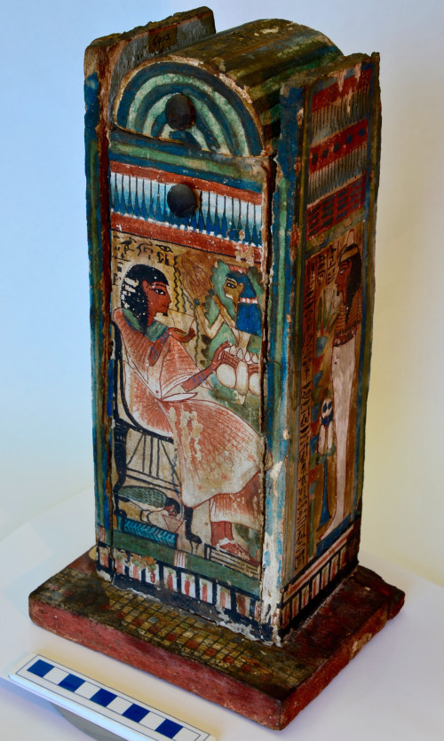

A partire dalla XVIII dinastia (1550-1295 a. C.) e fino all’età tolemaica (332-30 a. C.) le statuette funerarie, note con il nome di *[ushabty](https://blog.micropasts.org/2014/06/23/shabtis-and-the-ancient-egyptian-afterlife/),* furono spesso disposte all’interno di cofanetti per la maggior parte di legno. Durante tutto il Nuovo Regno (1550-1069 a. C.) e l’inizio del Terzo Periodo Intermedio (1069-945 a.C.) essi assunsero la forma di cappelle cultuali in miniatura.

Uno di questi è il [cofanetto dello Scriba Regale e Sovrintendente al Palazzo, Djehuty-hotep](http://crowdsourced.micropasts.org/project/MuseoEgizio1/), la cui superficie, stuccata e dipinta, presenta una decorazione che rievoca alcune credenze funerarie e concetti di rinascita dopo la morte, tipici del Nuovo Regno. Le scene sono arricchite da complessi elementi decorativi, geometrici.

Sul lato frontale si trova l’immagine del defunto che indossa un largo collare sopra un’elegante veste bianca, plissettata*.* Il Defunto è rappresentato seduto, mentre beve l’acqua della vita versata dalla Dea del sicomoro. Attinge al liquido anche il suo *ba*, uno degli elementi spirituali della persona, dal caratteristico aspetto di uccello a testa umana. Sui due lati si vede: a destra il defunto, mummificato; a sinistra Hapy e Amseti, due dei quattro geni funerari protettivi figli del dio falco Horo. Sul lato posteriore c’è ancora Djehuty-hotep rappresentato in piedi, in presenza di un sacerdote *sem*. Il cofanetto al suo interno doveva conservare 2-3 *ushabty* e lo stile suggerisce una datazione intorno alla XIX dinastia (1295 – 1186 a.C.).

[Paolo del Vesco](https://ucl.academia.edu/PaoloDelVesco) e [Paolo Marini](https://pisa.academia.edu/PaoloMarini) (Università di Pisa)