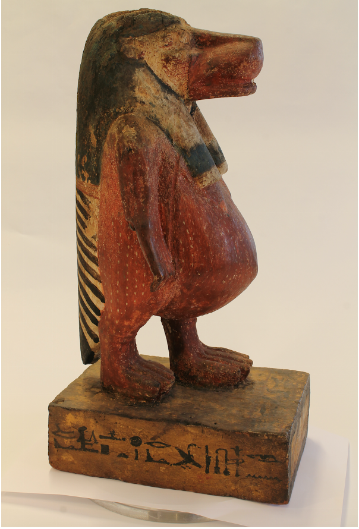

Questa statuetta [(Museo Egizio, Torino](http://www.museoegizio.it), numero di inventario Cat.526, 40 x 17 x 21.5 cm), intagliata nel legno e dipinta a colori vivaci, raffigura una divinità femminile chiamata *Taweret* (“La grande” in egiziano antico) ed è databile al Nuovo Regno, probabilmente alla diciannovesima dinastia (1292-1190 a.C.).

Parahotep, citato insieme a due suoi figli Pay e Ipuy nell’iscrizione posta sulla base, aveva il titolo di “scriba dei contorni”, o scriba disegnatore, viveva nel villaggio di Deir el-Medina (presso l’attuale Luxor, Riva Occidentale) ed era membro di una nota famiglia di artisti all’interno della quale questa professione, considerata abbastanza prestigiosa, fu tramandata di generazione in generazione, fino al nipote di Parahotep, Amenemope. A differenza di un suo fratello, anch’egli scriba disegnatore, che conosciamo da molteplici oggetti oggi sparsi nelle collezioni di vari musei europei, il nome di Parahot  
ep si è conservato solo su pochi reperti, fra i quali uno stipite iscritto proveniente da una delle porte della sua abitazione nel villaggio di Deir el-Medina, e questa statuetta molto particolare.

[La dea *Taweret*](http://micropasts.org/wp-content/uploads/2016/12/Screen-Shot-2016-12-05-at-21.46.29.png) è qui raffigurata con le sembianze di un ippopotamo femmina gravido in piedi sulle zampe posteriori, quelle anteriori terminanti con artigli leonini, una parrucca tripartita sul capo e la coda di un coccodrillo sul dorso. Le fauci leggermente aperte contribuiscono ad accrescere il senso di potenza e pericolosità di questa divinità che era in realtà preposta alla protezione delle partorienti e dei nascituri. Sia *Taweret*, che il dio *Bes*, dalle fattezze grottesche, erano oggetto di un culto popolare che si esprimeva in rituali realizzati per mezzo di statuette, stele di piccole dimensioni o amuleti all’interno delle abitazioni.

[Aiutaci a creare un modello 3D di questa statuetta!](http://crowdsourced.micropasts.org/project/Egizio2/)

Paolo Del Vesco