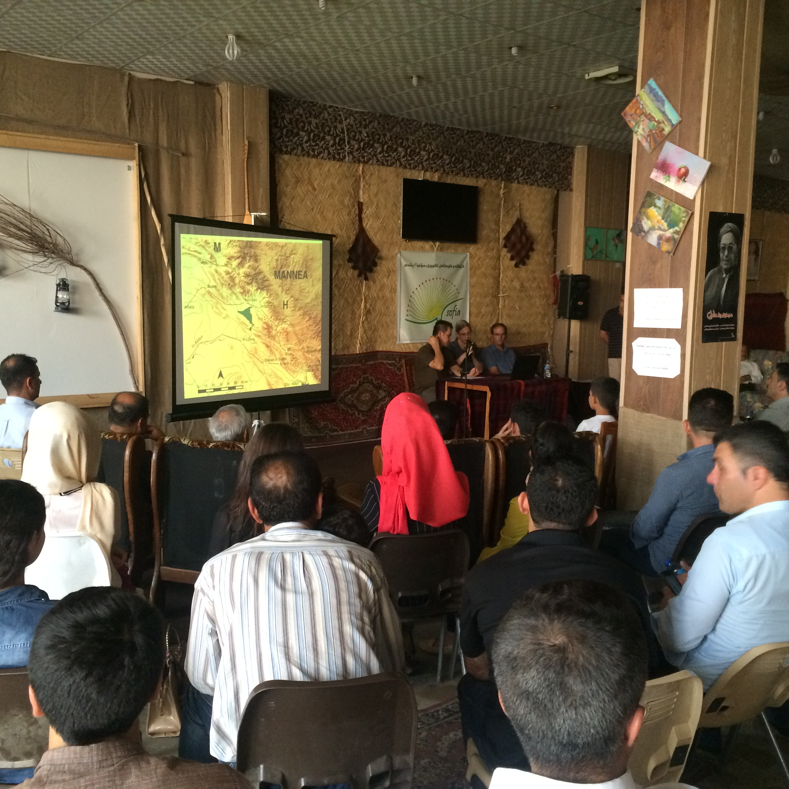
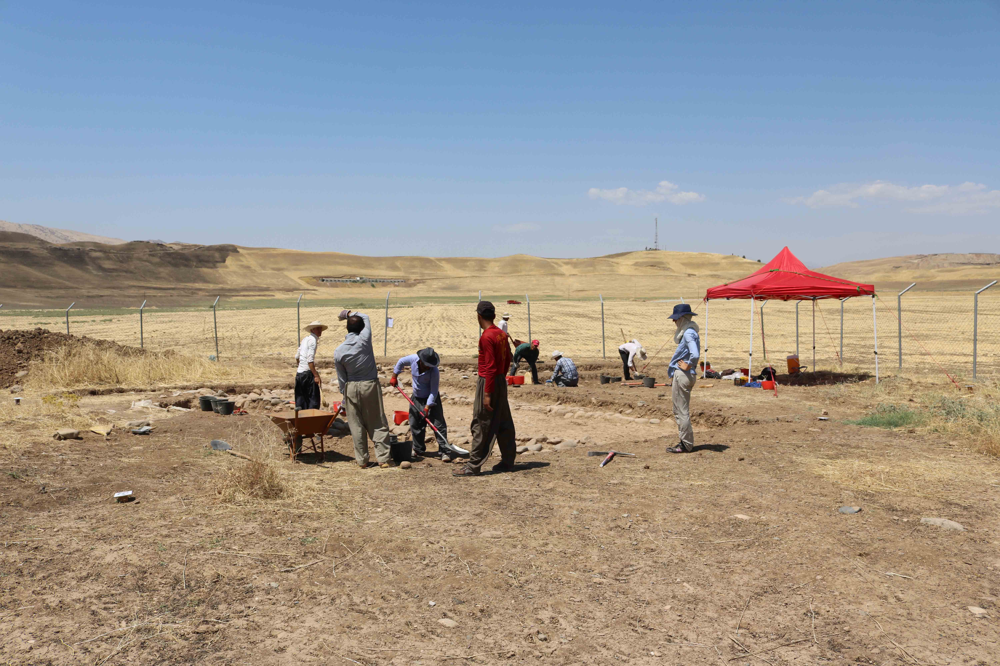
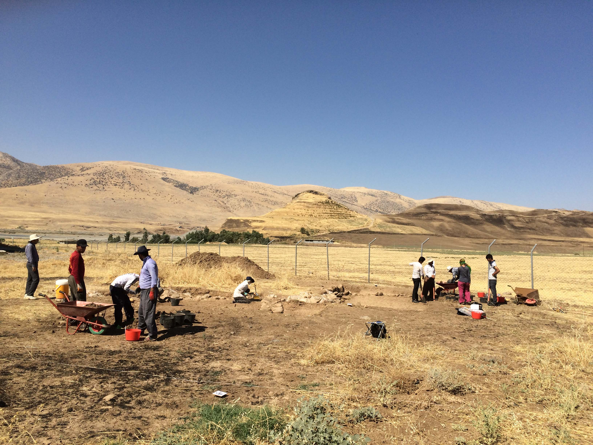
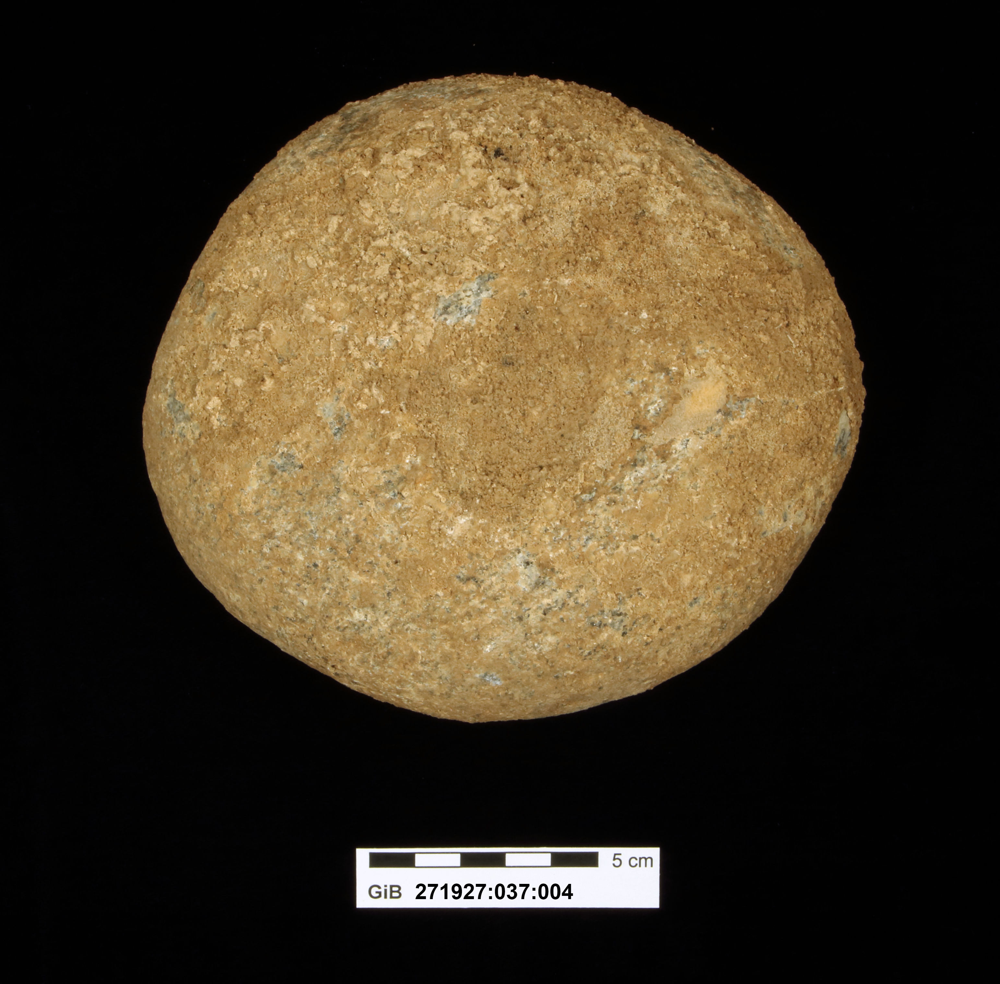

This summer, during the second fieldwork campaign at Gird i-Bazar, an archaeological site in the Kurdish Autonomous Region of Iraq dating to the Neo-Assyrian period (ca. 900-600 BCE), we had the pleasure to give a talk at SOFIA Café at Qaladze, the small town where our team is based. This very nice occasion prompted us to think about ways to make our work accessible to a wider audience – not just locally in Kurdistan, but beyond. As our project has strong links with UCL, we got in touch with the Micropasts team, whose big community of motivated and tireless online contributors has produced an impressive body of work on archaeological artefacts.

The [Peshdar Plain Project](http://www.en.ag.geschichte.uni-muenchen.de/chairs/chair_radner/research_radner/peshdar-plain-project/index.html) started in 2015 and aims to study the political, cultural and social landscapes of a frontier zone of the once powerful Assyrian Empire by surveying and excavating in this virtually unknown region. Digging up artefacts and structures and publishing the results for academic audiences is a key approach for archaeologists, but we want to involve also others who are interested in the past. Bringing people out to work on the dig in Kurdistan is difficult for a great many reasons – but now you can help us document, understand and publish our finds online, from the comfort of your home!

Our pilot project is a 3D photo-masking project. We ask you to help us with the documentation and dissemination of an artefact excavated this summer: a stone mortar with two holes on both sides that was found in a workshop in a bustling town at the border of the Assyrian Empire, flourishing 2700 years ago. Incidentally, the 3D documentation of the artefacts found in the archaeological excavation at Gird-i Bazar will also help us to make the local cultural heritage more accessible to the local community, as the museum where our finds are stored is located at Sulaymaniyah, some 300 km away. We are looking forward to seeing how the 3D model of the stone mortar will look like and how it could be used for outreach activities.

We hope that this pilot project is just a first step for a wider range of future activities with Micropasts. We hope that you will enjoy assisting us with the documentation of new artefacts as they are freshly dug up from the ground in 2017 and that you will participate online in our fieldwork. You will be helping us with tasks that we cannot hope to accomplish ourselves while out on the site. Thank you!

by [Karen Radner](http://www.ag.geschichte.uni-muenchen.de/personen/mitarbeiter/radner/index.html), [Janoscha Kreppner](http://www.en.ag.geschichte.uni-muenchen.de/staff/staff/kreppner/index.html), [Andrea Squitieri](http://www.en.ag.geschichte.uni-muenchen.de/staff/staff/squitieri/index.html), and [Alessio Palmisano](http://www.ucl.ac.uk/archaeology/people/staff/palmisano)

<http://crowdsourced.micropasts.org/project/IraqMortar/>