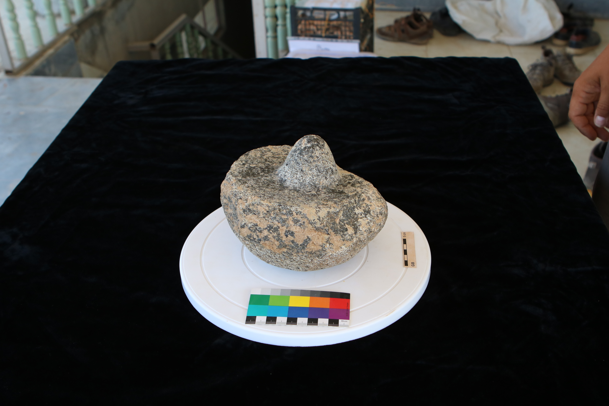
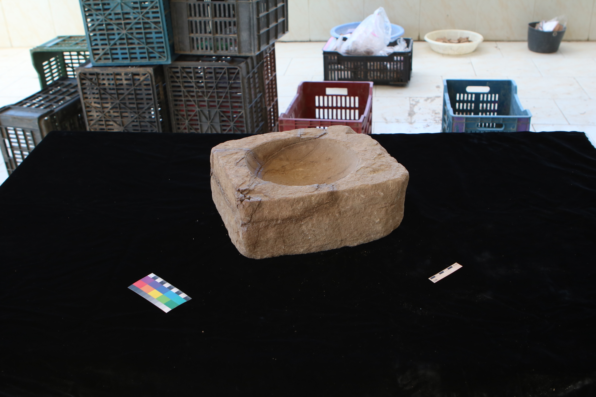

“Alone we can do so little, together we can do so much”. I believe this sentence encapsulates the essence of the Level 2 Digital Heritage course I am currently taking at the Department of Archaeology, Durham University. The focus of this course is heritage crowdsourcing, where we utilize the knowledge and skillsets of different people around the world to contribute to the heritage sector. This gradually builds a collaborative bond between institutions and the public, the likes of which is less seen in traditional GLAM institutions. As a task in our practical sessions with Digital Heritage, we have created a photo-masking project on MicroPasts for the public to contribute to.

The project concerns creating photo-masks for some excavated artefacts. *What is photo-masking?* What you see in the application we created are simple instructions which essentially boil down to: trace a tight polygon around an object and press submit – and there are 65 photos that need to go through this process. *Why do we do this and where do all those polygons go to?* This is where the magic happens. After collecting all the polygons, we arrange them in such a way that a “mesh” of the object is created. This allows us to form 3D digital sketches and models – you can see what objects have been created thus far on sketchfab. *What are these models for, you may ask?* Well, the digital models could be put on display in museums to be manipulated in all directions on screen; it could even be sent to a scholar far far away from the actual object so that they could examine the object through its 3D model. The possibilities are truly endless – and all stem from your help with tracing a polygon on your computer screens!

For the photo-masking project that we have created, we would like you to trace polygons around a square bowl and a potters’ pivot. These objects were excavated in the summer of 2017 in Iraq, by the University of Munich. They discovered these objects at an Iron Age site, which is roughly some 3000-4000 years ago! They have enlisted your help in creating photomasks for the two objects, to aid their study but also to bridge the bond between you, audience, and them. Every little helps, and with each polygon you make, we may learn just that much more about the past.

– Tullia Fraser

 

 