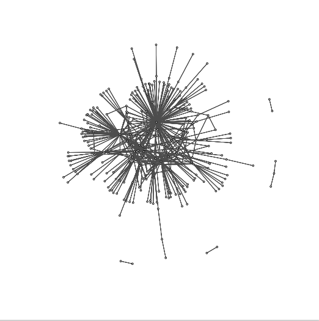
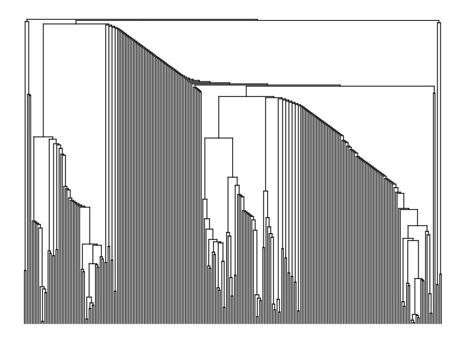

Digital engagement is beyond posting the odd picture of an artefact, as we learnt in our final practical session in Digital Heritage at Durham University. There is also a process of looking back and analyzing data, spotting trends and features to further improve whatever project you may be involved in. In this session, we utilized R software, an open-source software (and programming language). The task was to extract data from the MicroPasts Twitter account ([@MicroPasts](https://twitter.com/MicroPasts)), and conduct basic text analysis techniques.

This was a lot more challenging than I expected. Compared to the previous two sessions where we created the photo-masking application for artefacts found in Iraq – where we utilized programming languages such as Python 2.7; R seems to be a completely different world, with its own unique language involved. While following the tutorial’s instructions, I felt that I also had to grasp a new syntax.

Extracting data from Twitter first required us to create a token on the website, with unique keys to grant us access to extract this data. This was used in conjunction with “rtweet”, an implementation of calls to extract and manipulate data from Twitter, which was installed in R via install.packages(“rtweet”). Throughout this entire process, other libraries like “rtweet” were utilized, such as “tm” and “ggplot2”.

In my previous blog post, I had expressed concern about the ethical implications of analyzing tweets from Twitter. This doubt was very much answered in this session – when I was organizing the data, a lot of narrowing-down was involved. Punctuation, numbers, capitalization, commonly used words were all eliminated. Homonyms (like “fly” the insect and “fly”, the action), were reduced to its stem. While it was easy to extract the tweets, they become so edited in the analyzing process that I couldn’t possibly understand what the tweets were originally about. In this exercise, we found frequent terms used (which led us to the leaders of the project), and word associations. In this case, we could correlate a museum (the Mary Rose) to its key artefact, such as its bell – whose 3D-model was a project on MicroPasts.

<iframe title="Mary Rose Bell"  allowfullscreen mozallowfullscreen="true" webkitallowfullscreen="true" allow="autoplay; fullscreen; xr-spatial-tracking" xr-spatial-tracking execution-while-out-of-viewport execution-while-not-rendered web-share src="https://sketchfab.com/models/ad399a15ec484cd18fdbe4f96c65c7d0/embed"> </iframe>

Another interesting task I took up was network analysis of the account. Using retweets from MicroPasts’ account, we can establish a diagram of a network – people who interact with each other through MicroPasts. From this diagram, we can see that there are some central points in this network, but the individual points don’t seem too connected. With this knowledge, perhaps work can be done to target these outlying individuals and bring them all closer together. From this, we can also extrapolate the nature of the network here, in the form of density and reciprocity. In this case, the MicroPasts network isn’t dense at all (the black line is what is expected). However, the reciprocity of the network is so much higher than anticipated. This indicates that the community, while small, are responsive to each other, and almost close-knit. This is encouraging for sure.

A diagram showing the network of users associated with MicroPasts

A dendrogram showing the various communities within the wider network of MicroPasts users.

Digital Heritage has introduced us to participatory and collaborative working styles in the heritage sector, which we got to witness through our photo-masking project. These data science sessions with R software have given us a glimpse into the data science behind these working styles. After this course, I’ve definitely seen the potential of participatory approaches used in GLAM institutions, with the backing of data science.

Tullia Fraser