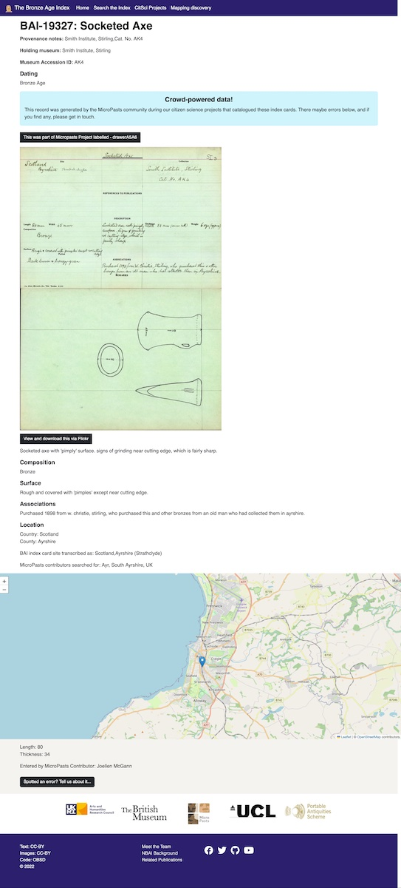
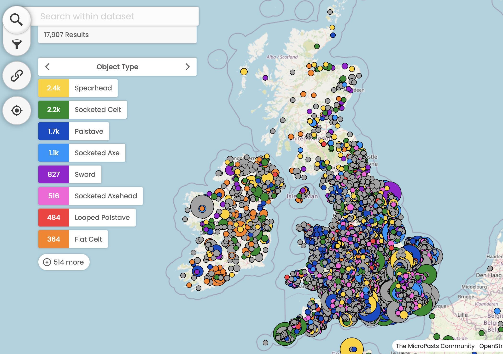

> There's something quite magical about the idea of an object that is still safely in our stores being given to a child to hold and experience so far away.

Back in 2013, our team was awarded Arts and Humanities Research Council (AHRC) funding 
to work on the MicroPasts project, which in part focused on the British Museum's locked away index cards
that made up the inventory of Bronze Age implements found and reported to them since 1913. The great Maev Kennedy 
wrote about the beginning of this journey in the [Guardian (August 2014)](https://www.theguardian.com/science/2014/aug/18/volunteers-british-museum-crowdsourcing-archeology)
and this project has been a labour that has taken longer than we had hoped to complete. 

Nearly 10 years later, one of the major outputs from this has been formed from the [citizen science projects](https://crowdsourced.micropasts.org) that 
Jennifer Wexler, Neil Wilkin, Chiara Bonacchi and Adi Keinan-Schoonbaert facilitated to digitise the British Museum's 
National Bronze Age Implement Index. Since we were awarded funding, our team has moved on from their original roles, changing titles, moving institutions, learning new things, delivering the
blockbuster [World of Stonehenge exhibition](https://www.britishmuseum.org/exhibitions/world-stonehenge)...

This [new website](https://bronze-age-index.micropasts.org), brings together 110 years of antiquarian research, alongside data crowd sourced by MicroPasts volunteers,
by the Portable Antiquities Scheme and an array of 3D models generated by crowd sourcing into one resource using technologies 
that anyone can access. 

Based on the principles we embraced from the start, we used open source software
to develop and serve the content online via Github's free pages platform. To achieve our aims we used:

* Markdown for page content
* CSV files for data (manipulated by R (to enrich and geocode) and Python (to split the files) and a bit of Openrefine)
* [Flickr](https://flickr.com/finds) for hosting BAI images
* The PAS's [open source system](https://finds.org.uk) (built by Dan) to serve their images
* [Meilisearch](https://www.meilisearch.com) to provide a search engine (running on a t2.micro free tier AWS server)
* [Gatsby](https://www.gatsbyjs.com) to power the static website and a wide range of plugins to make it work hard
* [React](https://reactjs.org) as the programming language
* A customised [Peripleo library](https://github.com/britishlibrary/peripleo-lanc) to power the [map interface](https://mapping-the-bronze-age.micropasts.org)  (built on software created by Rainer Simon for the Pelagios community and originally funded by the Open University, with advice from Elton Barker), which allows users to drill deeper into these data
* Bootstrap 5 for the css framework

Everything is released under open licence on our [Github profile](https://github.com/micropasts)- the website code, the data scripts in R and Python, the images, the raw data, the 3D models. 

Please feel free to reuse anything we've created to deliver this resource. We hope it will be useful to researchers, students, teachers, and the general public.
